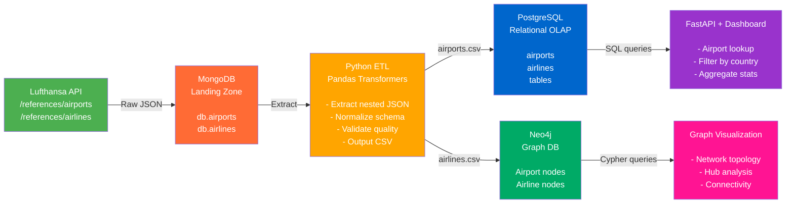
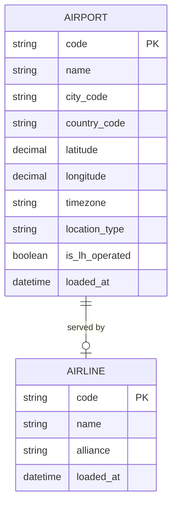
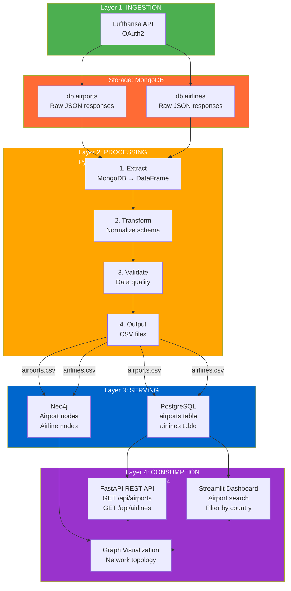
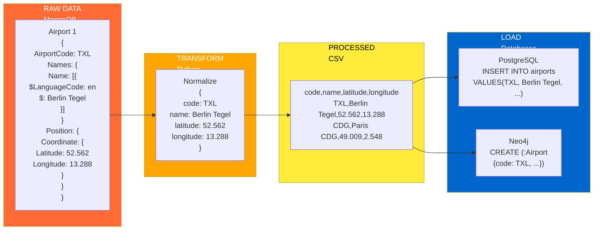
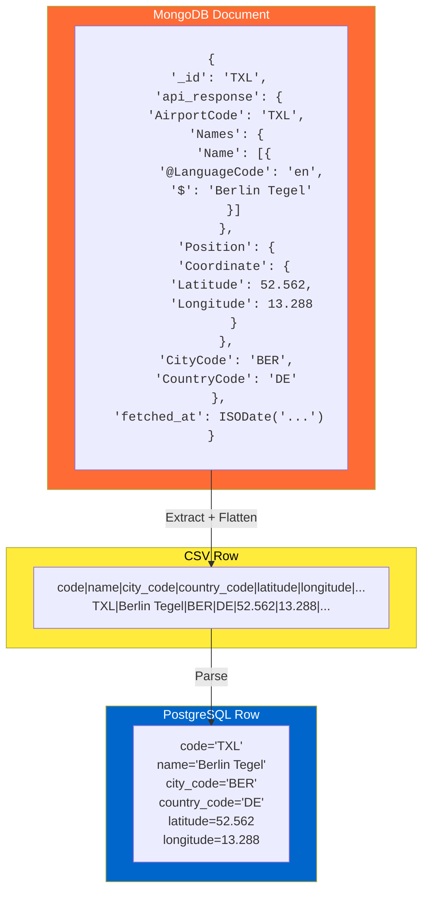
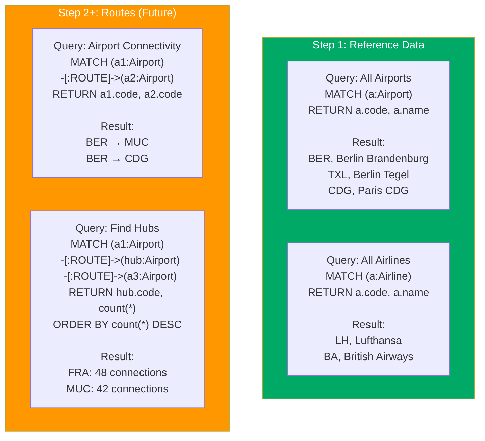
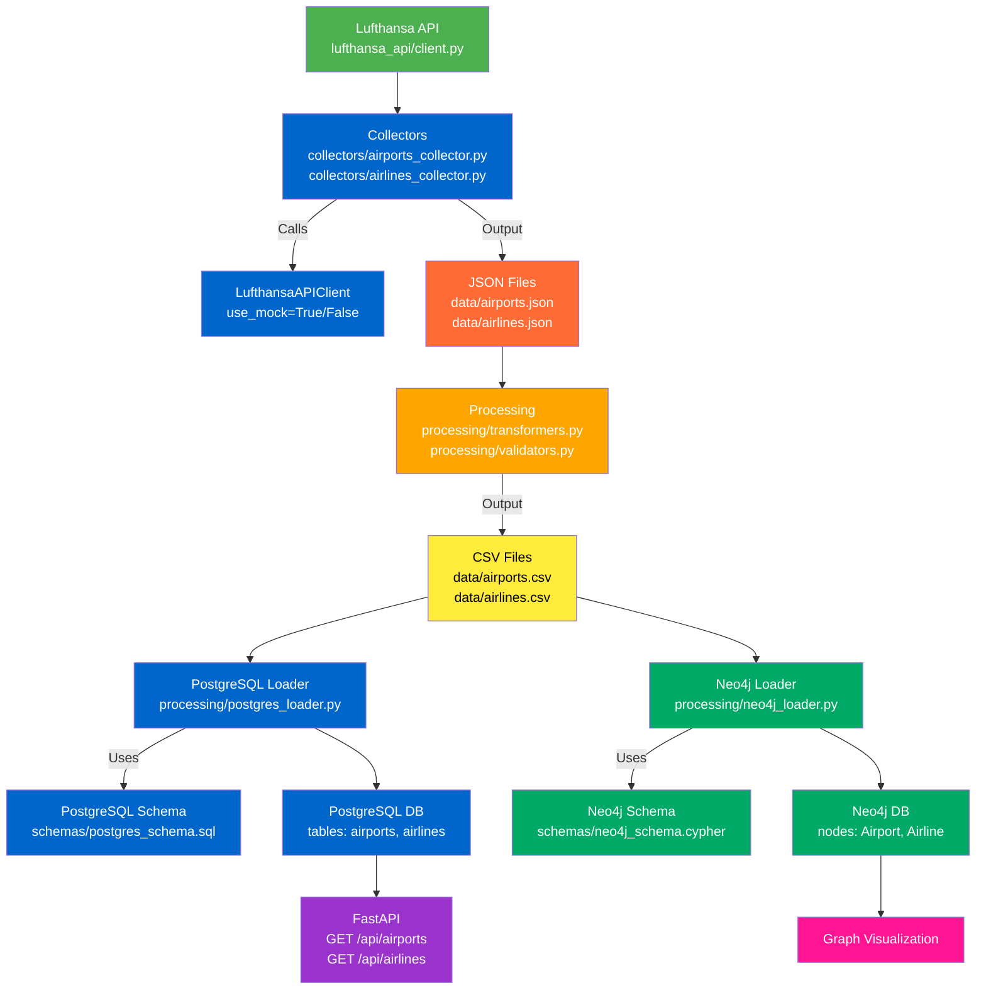

# Architecture Diagrams (Mermaid)

## Data Flow Diagram

---

## Entity Relationship Diagram

---

## Layer Architecture

---

## Processing Pipeline Detail

---

## MongoDB to PostgreSQL Transformation Example

---

## Neo4j Query Examples (Step 1 & Future)

---

## File Dependencies

