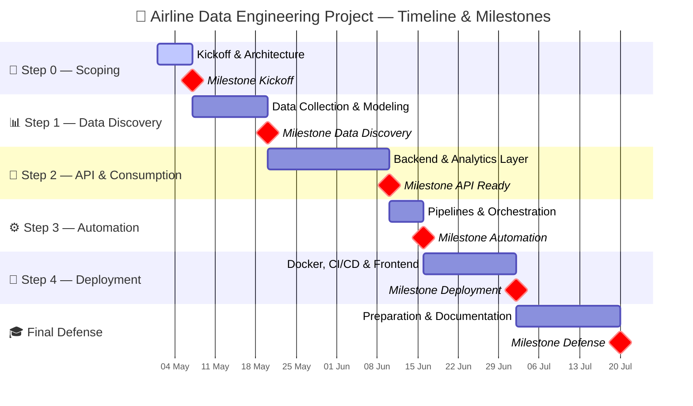

# Airline Project Timeline & Milestones

```mermaid
---
config:
    theme: default
    gantt:
        barHeight: 24
        barGap: 6
        topPadding: 50
        leftPadding: 180
        gridLineStartPadding: 35
        fontSize: 13
        sectionFontSize: 14
        numberSectionStyles: 4
---
gantt
    title 🛫 Airline Data Engineering Project — Timeline & Milestones
    dateFormat YYYY-MM-DD
    axisFormat %d %b
    tickInterval 1week
    weekday monday
    todayMarker stroke-width:3px,stroke:#FF6B6B,opacity:0.8

    section 🎯 Step 0 — Scoping
    Kickoff & Architecture          :active, t0, 2026-05-01, 2026-05-07
    Milestone Kickoff               :crit, milestone, m0, 2026-05-07, 0d

    section 📊 Step 1 — Data Discovery
    Data Collection & Modeling      :t1, after t0, 2026-05-20
    Milestone Data Discovery        :crit, milestone, m1, 2026-05-20, 0d

    section 🔌 Step 2 — API & Consumption
    Backend & Analytics Layer       :t2, after t1, 2026-06-10
    Milestone API Ready             :crit, milestone, m2, 2026-06-10, 0d

    section ⚙️ Step 3 — Automation
    Pipelines & Orchestration       :t3, after t2, 2026-06-16
    Milestone Automation            :crit, milestone, m3, 2026-06-16, 0d

    section 🚀 Step 4 — Deployment
    Docker, CI/CD & Frontend        :t4, after t3, 2026-07-02
    Milestone Deployment            :crit, milestone, m4, 2026-07-02, 0d

    section 🎓 Final Defense
    Preparation & Documentation     :t5, after t4, 2026-07-20
    Milestone Defense               :crit, milestone, m5, 2026-07-20, 0d
```