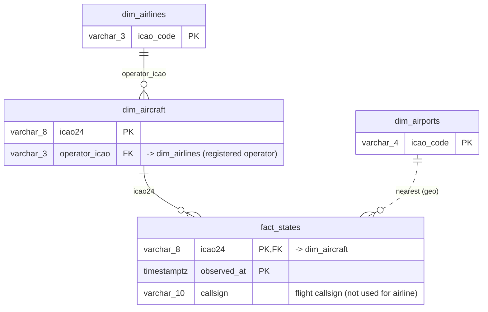
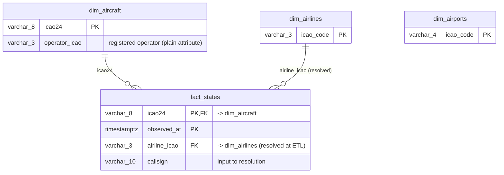

# ADR 008 — Airline Attribution: Star (resolved `airline_icao`) over Snowflake

**Status:** Accepted
**Date:** 2026-06-02
**Builds on:** ADR 003 (dual-stream), ADR 004 (Mongo landing-zone hub), ADR 007 (decouple / Neon warehouse)

---

## Context

The Silver-layer relational model (`architecture/silver-layer-er.md`) centres on **`fact_states`** — live
"aircraft in the air" observations from the OpenSky `/states/all` API (one row per aircraft per
timestamp). Dimensions enrich it: `dim_aircraft` (OpenSky AircraftDB), `dim_airlines` (OpenFlights),
`dim_airports` (OurAirports).

A modelling decision was required: **how is each observation attributed to an airline?** There are
two genuinely different airlines for any observation:

| Concept | Source | Nature |
|---|---|---|
| **Registered operator** of the airframe | `dim_aircraft.operator_icao` (AircraftDB) | slowly changing — a property of the **aircraft** |
| **Operating airline of *this* flight** | the `callsign` on the observation (`DLH123` → `DLH`) | per-flight — a property of the **event** |

These differ under wet-lease, charter, and codeshare: an aircraft flies under a callsign that is not
its registered operator. The same modelling pass also had to settle the **airport** relationship,
since `/states/all` provides only a live position — no origin/destination.

---

## Decision

1. **Star schema for the airline arm.** Materialise a resolved **`airline_icao`** column on
   `fact_states` (single-hop FK → `dim_airlines`), instead of reaching the airline via
   `dim_aircraft` (snowflake).
   - **ETL resolution rule:** `airline_icao = COALESCE(dim_aircraft.operator_icao, callsign_prefix(callsign))`
     — registered operator first, ICAO callsign prefix as fallback; `NULL` when neither resolves to
     a known airline.
   - `dim_aircraft.operator_icao` remains a plain attribute (the airframe's registered operator),
     an *input* to the resolution — no longer the fact's airline path.

2. **`dim_airports` is a standalone reference table — no fact relationship.** States data carries no
   origin/destination, so a "nearest airport" join would be a geometric guess that says nothing about
   a flight's route. **From/to is therefore unknown** in this Silver model. Capturing real
   source/destination is deferred to the Bronze layer (needs a scheduled-flight / flight-leg source).

3. **All dimension joins are LEFT/outer.** A `fact_states` observation must survive when a dimension
   lookup misses; fact integrity does not depend on dimension completeness.

---

## Considered options

### Option A — Snowflake (rejected)

Airline hangs off the aircraft dimension; the fact reaches it in two hops (`fact → aircraft → airline`).



```sql
-- 2 joins
SELECT al.name, count(*) FROM fact_states f
JOIN dim_aircraft ac ON ac.icao24 = f.icao24
JOIN dim_airlines al ON al.icao_code = ac.operator_icao
GROUP BY al.name;
```

### Option B — Star (chosen)

A resolved `airline_icao` lives on the fact; every dimension joins directly in one hop.



```sql
-- 1 join
SELECT al.name, count(*) FROM fact_states f
JOIN dim_airlines al ON al.icao_code = f.airline_icao
GROUP BY al.name;
```

---

## Rationale

| | Snowflake (A) | Star (B) |
|---|---|---|
| Airline FK lives on | `dim_aircraft` | `fact_states` |
| Join hops fact→airline | 2 | 1 |
| Airline meaning | registered operator of airframe | **operating airline of the flight** |
| Callsign fallback | ❌ impossible | ✅ built into resolution |
| Extra fact column | none | `airline_icao` (varchar_3, negligible) |
| ETL work | none extra | resolve per row |
| Kimball orthodoxy | discouraged | preferred |

The deciding factor is **semantics, not tidiness**: the callsign on each observation describes the
airline operating *that* flight — which is what flight/airline analytics actually want, and it differs
from the airframe's registered operator under wet-lease/charter. Star also enables the COALESCE
fallback (so an airline is still attributed when the AircraftDB has no operator) and keeps
`dim_airlines` a clean conformed dimension directly on the fact. The only cost — one tiny column on a
large table plus an ETL resolution step — is exactly where we want that logic to live.

**Snowflake was rejected** because it can only ever show the airframe's registered operator, offers no
fallback, and forces two-hop joins that BI tools dislike.

---

## Consequences

- `fact_states` gains `airline_icao` (FK → `dim_airlines`, nullable); the airline relationship moves
  from `dim_aircraft` to the fact. Reflected in `silver-layer-er.md` and `schema.sql`.
- `dim_aircraft.operator_icao` is demoted from FK to plain attribute.
- ETL must compute `airline_icao` per row (COALESCE rule) and may upsert stub `dim_aircraft` rows so
  the `icao24` FK holds while preserving outer-join (NULL-attribute) semantics.
- `dim_airports` stays unjoined (standalone reference); origin/destination is explicitly out of scope
  for Silver and parked as a Bronze-layer concern.
- The replaced decision-aid document `architecture/warehouse-er.md` is removed; this ADR is its
  permanent home.

---

## Related

- [`architecture/silver-layer-er.md`](../architecture/silver-layer-er.md) — the Silver model this decision shapes
- [ADR 003](003-dual-stream.md), [ADR 004](004-mongo-as-multisource-hub.md), [ADR 007](007-decouple-from-liora-vm.md)
