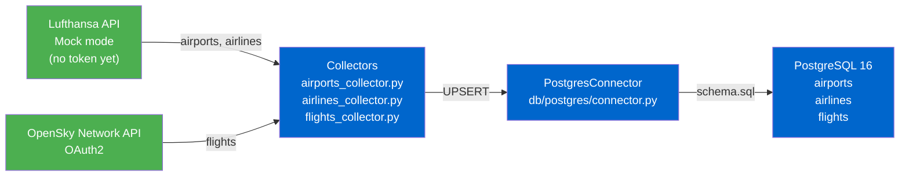
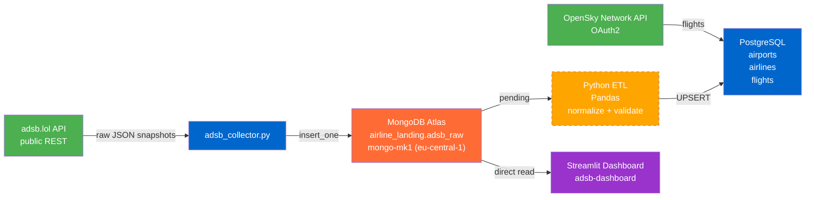
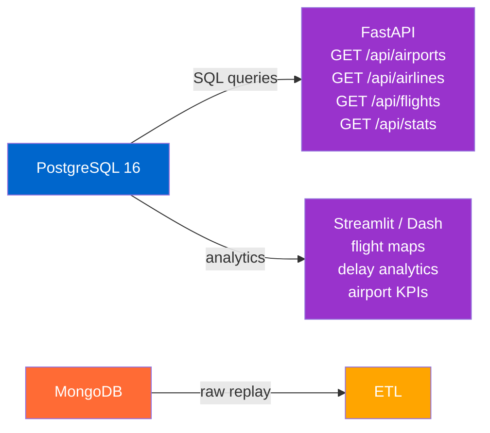
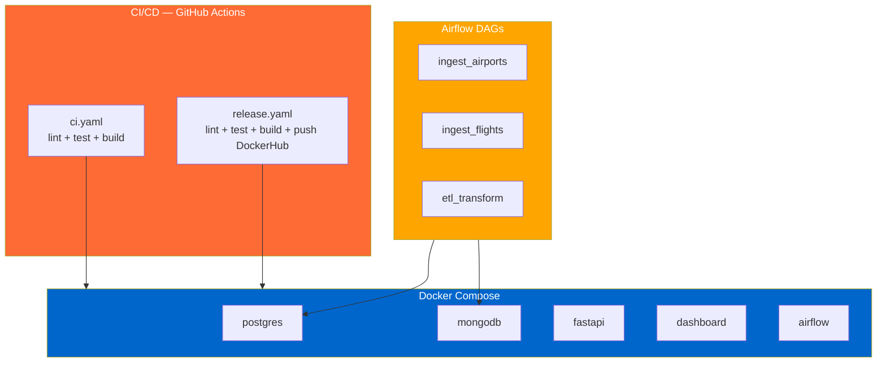
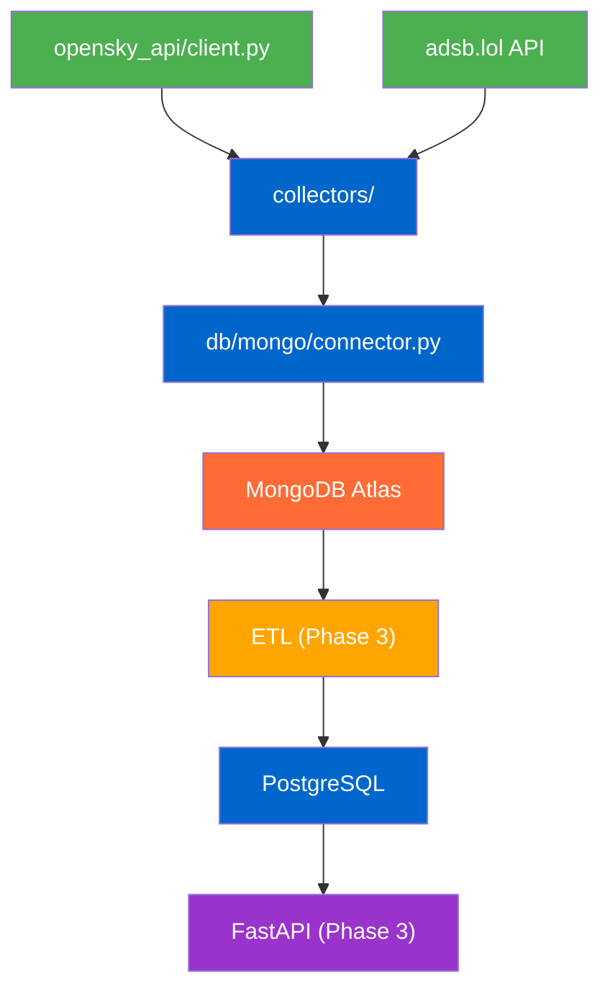
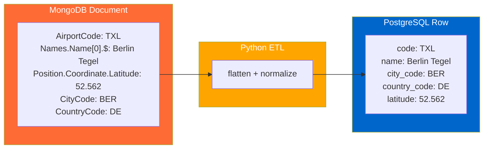

# Architecture

Architecture evolves per project phase. Each phase diagram shows the complete system at that point in time.

**Related:**
- [data-flow.md](data-flow.md) — prose explanation of data flow
- [erd.md](erd.md) — Entity Relationship Diagram
- [../adr/](../adr/) — Architecture Decision Records (why)
- [../timeline.md](../timeline.md) — deadlines

---

## Phase 1 — Data Collection ✅
*Deadline: 20.05.2026 — current phase*

Direct ingestion from two APIs into PostgreSQL. MongoDB deferred (see ADR 001).

**What existed at Phase 1 close:**
- `opensky_api/` — OpenSky client (OAuth2)
- `db/postgres/` — connector + schema
- Note: Lufthansa API integration was planned but never implemented (no key — see ADR 004)

---

## Phase 2 — Two-Layer Storage 🚧
*Deadline: within Step 2 — 10.06.2026 — in progress*

MongoDB as raw landing zone active for ADS-B stream. ETL to PostgreSQL pending.

**What exists now:**
- `db/mongo/connector.py` — MongoDB connector ✅
- `collectors/adsb_collector.py` — ADS-B collector ✅
- `collectors/opensky_collector.py` — OpenSky collector (local only) ✅
- `airline_landing.adsb_raw` / `opensky_raw` / `flight_tracker_raw` — live on Atlas ✅
- `04-dashboard/adsb-dashboard/` — Streamlit dashboard ✅

**What is pending:**
- `etl/` — ETL pipeline: adsb_raw → PostgreSQL

---

## Phase 3 — API & Dashboard
*Deadline: Step 2+3 — 10.06.2026 → 16.06.2026*

Expose data via FastAPI. Visualize via Streamlit or Dash.

**What will be added:**
- `05-backend/` — FastAPI service
- `06-dashboard/` — Streamlit or Dash app

---

## Phase 4 — Deployment & Automation
*Deadline: Step 4 — 02.07.2026*

Containerize everything. Automate ingestion. Add CI/CD.

**What will be added:**
- `07-devops/` — Dockerfiles, docker-compose.yml, GitHub Actions

---

## Technical Details

### Entity Relationship Diagram

Moved to [erd.md](erd.md).

---

### File Dependencies (Phase 2)

---

### MongoDB → PostgreSQL Transformation (Phase 2 reference)

