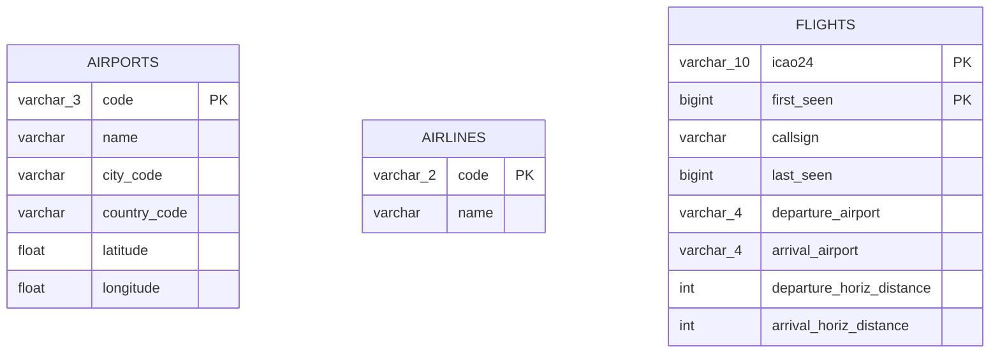
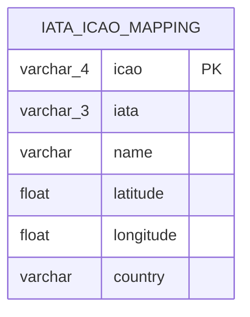

# Entity Relationship Diagram

PostgreSQL warehouse schema (Phase 1).

> **Note on airport codes:** `airports` uses IATA codes (3 chars, e.g. `BER`) from the LH API.
> `flights` uses ICAO codes (4 chars, e.g. `EDDB`) from OpenSky.
> No foreign key between the two — a IATA ↔ ICAO mapping table will be added in Phase 2
> (see [ADR 003](../adr/003-dual-stream.md)).

---

## Phase 2 addition (planned)

Source: [OurAirports.com](https://ourairports.com/data/) CSV (~28k airports, one-time import).
