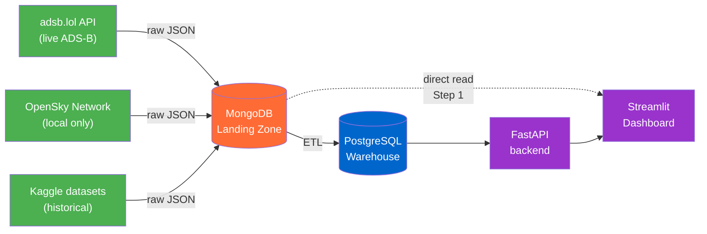

# Airline Data Engineering Platform

End-to-end data pipeline for live airline / flight data — built as the capstone project of the **DataScientest Data Engineer Bootcamp**.

📋 **Project status:** Step 1 complete (2026-05-27), Step 2 in progress (deadline 10.06.2026) — see [docs/requirements](docs/requirements/README.md)

---

## What this is

A multi-source data platform that ingests live ADS-B and airline data into a **MongoDB landing zone**, transforms it into a **PostgreSQL warehouse**, and exposes it through a **FastAPI** backend and a **Streamlit** dashboard.

The platform is built under real-world constraints: no premium API access, a partially network-restricted training VM, and an evolving feature set — which makes it a more realistic Data Engineering exercise than a textbook example.

---

## Architecture at a glance

**Why MongoDB as a multi-source hub?** See [ADR 004](docs/adr/004-mongo-as-multisource-hub.md) — driven by real project constraints (VM blocks OpenSky, no premium API access), but also a strong Data Engineering pattern: decouple ingestion from transformation.

---

## Status

| Step | Topic | Deadline | Status |
|---|---|---|---|
| 0 | Scoping & Kickoff | 07.05.2026 | ✅ |
| 1 | Data Discovery & Organization | 20.05.2026 | 🚧 |
| 2 | Data Consumption & API | 10.06.2026 | ⏳ |
| 3 | Automation & Pipelines | 16.06.2026 | ⏳ |
| 4 | Deployment & Frontend | 02.07.2026 | ⏳ |
| Final Defense | Presentation & Demo | 20.07.2026 | ⏳ |

**Live now:** ADS-B collector → MongoDB landing zone → Streamlit dashboard.
**Next:** UML/ERD, ETL pipeline, FastAPI backend.

---

## Team

| | Role |
|---|---|
| **Matthias Köhler** | Data Engineering, infrastructure, deployment |
| **Pavel** | Data Engineering, API integration |
| **Chaithra** | Data Engineering |
| Nicolas (mentor) | DataScientest — bootcamp supervision |

---

## Repository structure

The **knowledge layer** lives in `docs/` (project-wide, un-numbered); the **numbered folders are the
pipeline phases** (Bronze → Silver → consumption → deployment).

| Path | What's inside |
|---|---|
| **[docs/](docs/)** | Knowledge layer: [requirements](docs/requirements/), [ADRs](docs/adr/), [architecture](docs/architecture/), [data-sources](docs/data-sources/), [report](docs/report/), setup guides |
| **[01-bronze/](01-bronze/)** | Collectors → **Bronze** (MongoDB): OpenSky States, adsb.lol, reference loaders |
| **[02-silver/](02-silver/)** | **Bronze → Silver**: [`etl/`](02-silver/etl/) + [`warehouse/`](02-silver/warehouse/) (PostgreSQL star schema) |
| **[03-gold/](03-gold/)** | Consumption layer: [`api/`](03-gold/api/) (FastAPI) + [`dashboard/`](03-gold/dashboard/) (Streamlit). `warehouse/` (Gold aggregates) planned — [ADR 011](docs/adr/011-layer-named-folders-connector-abstraction-ml.md) |
| **[deployment/](deployment/)** | docker-compose, scheduler, orchestration (un-numbered, cross-cutting) |
| **[data_connectors/](data_connectors/)** | Provider-abstracted DB access: `mongo.py` (Bronze), `supabase.py` (Silver) — [ADR 011](docs/adr/011-layer-named-folders-connector-abstraction-ml.md) |
| **[notebooks/](notebooks/)** | Exploration + collector walkthroughs (`explore_*`, `collect_*`) |

---

## Documentation

- **[Scope & deliverables](docs/requirements/scope.md)** — what we build per phase, explicit non-goals
- **[Architecture](docs/architecture/README.md)** — phase diagrams, data flow, ERD
- **[Architecture Decision Records](docs/adr/)** — *why* the design looks like it does
- **[Local setup](docs/setup.md)** — venv, dependencies, `.env`, running notebooks
- **[ADS-B collector walkthrough](notebooks/collect_adsb.ipynb)** — step-by-step Jupyter notebook explaining the collector

---

## AI collaboration

This project is developed with [Claude](https://www.anthropic.com/claude) (Anthropic) as a coding assistant — used for architecture discussions, code generation, refactoring, and documentation. All design decisions, reviews, and final commits are made by the human authors.
