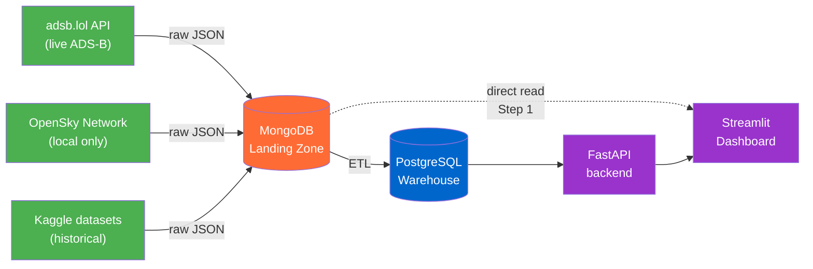

# Airline Data Engineering Platform

End-to-end data pipeline for live airline / flight data — built as the capstone project of the **DataScientest Data Engineer Bootcamp**.

🛫 **Live demo:** http://liora-vm.matthiaskoehler.com:8502
📋 **Project status:** Step 1 in progress (deadline 20.05.2026) — see [01-requirements](01-requirements/README.md)

---

## What this is

A multi-source data platform that ingests live ADS-B and airline data into a **MongoDB landing zone**, transforms it into a **PostgreSQL warehouse**, and exposes it through a **FastAPI** backend and a **Streamlit** dashboard.

The platform is built under real-world constraints: no premium API access, a partially network-restricted training VM, and an evolving feature set — which makes it a more realistic Data Engineering exercise than a textbook example.

---

## Architecture at a glance

**Why MongoDB as a multi-source hub?** See [ADR 004](01-requirements/adr/004-mongo-as-multisource-hub.md) — driven by real project constraints (no Lufthansa key, VM blocks OpenSky), but also a strong Data Engineering pattern: decouple ingestion from transformation.

---

## Status

| Step | Topic | Deadline | Status |
|---|---|---|---|
| 0 | Scoping & Kickoff | 07.05.2026 | ✅ |
| 1 | Data Discovery & Organization | 20.05.2026 | 🚧 |
| 2 | Data Consumption & API | 10.06.2026 | ⏳ |
| 3 | Automation & Pipelines | 16.06.2026 | ⏳ |
| 4 | Deployment & Frontend | 02.07.2026 | ⏳ |
| Final Defense | Presentation & Demo | 20.07.2026 | ⏳ |

**Live now:** ADS-B collector → MongoDB landing zone → Streamlit dashboard.
**Next:** UML/ERD, ETL pipeline, FastAPI backend.

---

## Team

| | Role |
|---|---|
| **Matthias Köhler** | Data Engineering, infrastructure, deployment |
| **Pavel** | Data Engineering, API integration |
| **Chaithra** | Data Engineering |
| Nicolas (mentor) | DataScientest — bootcamp supervision |

---

## Repository structure

| Path | What's inside |
|---|---|
| **[01-requirements/](01-requirements/README.md)** | Project specs, architecture, ADRs, timeline |
| **[02-api-docs/](02-api-docs/)** | External API references (Lufthansa Swagger, etc.) |
| **[03-data-collection/](03-data-collection/)** | Collectors, DB connectors, exploration notebooks |
| **[04-dashboard/](04-dashboard/adsb-dashboard/)** | Streamlit dashboard (deployed to Liora VM) |
| **[docs/](docs/setup.md)** | Setup guide and additional documentation |

Pending: `05-backend/` (FastAPI), `06-devops/` (Docker Compose, CI/CD), `07-final-defense/`.

---

## Documentation

- **[Scope & deliverables](01-requirements/scope.md)** — what we build per phase, explicit non-goals
- **[Architecture](01-requirements/architecture/README.md)** — phase diagrams, data flow, ERD
- **[Architecture Decision Records](01-requirements/adr/)** — *why* the design looks like it does
- **[Local setup](docs/setup.md)** — venv, dependencies, `.env`, running notebooks
- **[ADS-B collector walkthrough](03-data-collection/collect_adsb.ipynb)** — step-by-step Jupyter notebook explaining the collector

---

## AI collaboration

This project is developed with [Claude](https://www.anthropic.com/claude) (Anthropic) as a coding assistant — used for architecture discussions, code generation, refactoring, and documentation. All design decisions, reviews, and final commits are made by the human authors.
