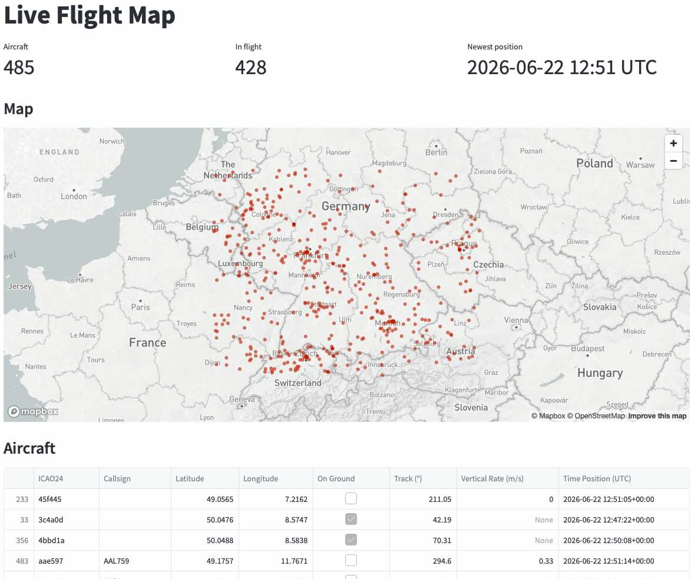

# Airline Data Engineering Platform

End-to-end data pipeline for live airline / flight data — built as the capstone project of the **DataScientest Data Engineer Bootcamp**. See [docs/requirements](docs/requirements/README.md) for scope and deliverables.

---

## What this is

A multi-source data platform that ingests live ADS-B and airline data into a **MongoDB landing zone**, transforms it into a **PostgreSQL warehouse**, and exposes it through a **FastAPI** backend and a **Streamlit** dashboard.

The platform is built under real-world constraints: no premium API access, a partially network-restricted training VM, and an evolving feature set — which makes it a more realistic Data Engineering exercise than a textbook example.

---

## Live

- **Production landing page** — [airline.matthiaskoehler.com](https://airline.matthiaskoehler.com) · gateway to the live map, live-traffic view, and the flight-delay prediction API.
- **Q (staging / PR preview)** — [q-airline.matthiaskoehler.com](https://q-airline.matthiaskoehler.com) · the stage environment that mirrors prod and deploys pull-request previews.
- **Project presentation** — [interactive slide deck](https://matthiassails.github.io/airline-data-platform/report/project-presentation.dc.html) · engineering overview (architecture, databases, CI/CD, ML) published via GitHub Pages.

---

## Team

| | Role |
|---|---|
| **Matthias Köhler** | Data Engineering, infrastructure, deployment |
| **Pavel** | Data Engineering, API integration |
| **Chaithra** | Data Engineering |
| Nicolas (mentor) | DataScientest — bootcamp supervision |

---

## AI collaboration

This project is developed with [Claude](https://www.anthropic.com/claude) (Anthropic) as a coding assistant — used for architecture discussions, code generation, refactoring, and documentation. All design decisions, reviews, and final commits are made by the human authors. See the root [CLAUDE.md](CLAUDE.md) for project-specific context and conventions.
