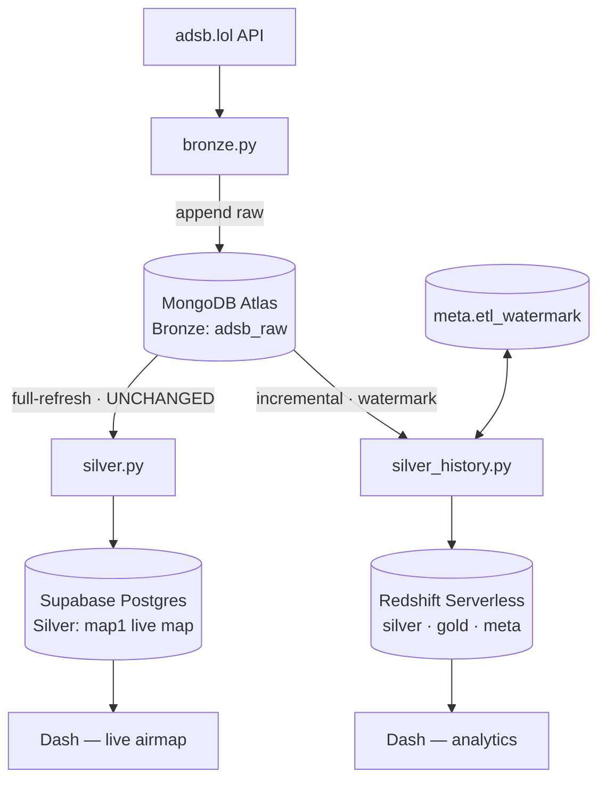

# ADR 020 — Amazon Redshift Serverless as the Analytical Warehouse (OLAP); Supabase Stays Live-Map Serving (OLTP)

**Status:** Proposed
**Date:** 2026-07-15
**Builds on:** ADR 001 (Postgres-first), ADR 002 (psycopg2), ADR 009 (States/positions as central Silver fact), ADR 014 (adsb.lol fallback), ADR 015 (Docker-loop scheduling)

---

## Context

The implemented Silver layer is `map1` on Supabase Postgres — a **full-refresh snapshot**
(`DELETE` + reload of the freshest Bronze snapshot). `map1` never grows: it holds only the
current aircraft, fits Supabase's 512 MB free tier indefinitely, and serves the live-map
dashboard with low latency.

We want a **historical** analytical layer: accumulate positions over time and build a star
schema for time-series analysis. That data grows without bound — Supabase's 512 MB free tier
cannot hold it, and Postgres row-store is the wrong engine for large analytical scans. The
history already exists in MongoDB Bronze (`adsb_raw`, every poll retained with `fetched_at`),
so it can be replayed into a new store.

The team weighed **BigQuery vs. Amazon Redshift Serverless** and chose Redshift.

## Decision

1. Introduce **Amazon Redshift Serverless** as the analytical warehouse, schemas `silver`,
   `gold`, `meta` (`etl/sql/warehouse_redshift.sql`).
2. Add `etl/silver_history.py`: reads Mongo Bronze **incrementally** by a watermark on
   `fetched_at`, and idempotently loads a **star schema** — `gold.dim_aircraft`,
   `gold.dim_date`, `gold.fact_aircraft_position`, `gold.fact_flight_summary`
   (see ADR 021, ADR 022).
3. **adsb.lol only.** `registration`/`type_code` come from adsb's `r`/`t`; there is **no**
   OpenSky, **no** AircraftDB, **no** `dim_aircraft_type`, and **no S3** reference-loading.
4. `etl/silver.py`, `map1`, and the live-map serving path **stay on Supabase Postgres,
   unchanged.**
5. Split by workload: **Supabase = operational serving (live map, OLTP); Redshift = analytical
   history (OLAP).**

## Rationale

- **OLTP/OLAP separation.** Redshift (columnar MPP) is wrong for a live map refreshing every
  few seconds (latency, per-RPU billing) but right for growing analytical scans. Supabase is
  the reverse. Each engine is used for what it is built for. Rejected: putting the live map on
  Redshift too (loses always-on, low-latency serving).
- **Storage.** History grows → needs a warehouse; `map1` doesn't grow → 512 MB stays fine.
  Rejected: keeping history in Supabase (512 MB fills quickly).
- **AWS consolidation.** Compute already runs on AWS (Lightsail Q-VM, ADR 007/015). Redshift
  keeps everything in one account/IAM. Rejected: BigQuery (a second cloud to operate).
- **Cost, honestly.** Redshift Serverless is **not free long-term** — it bills per RPU-hour
  while active. It is covered now by the account's credits ($300 Redshift trial + retained
  $140). Mitigations: `run_silver_history.sh` batches loads on a **15-minute** loop (not the
  live-map's 20 s) to keep the workgroup mostly idle; a post-credit plan (accept a small
  monthly cost, or pause the workgroup) is required.
- **Relationship to ADR 002 (psycopg2).** Redshift is Postgres-wire-compatible, so
  `silver_history.py` connects with **psycopg2** — no new driver, no reversal of ADR 002.

## Consequences

- No new Python dependency for the loader (psycopg2 already pinned). `boto3` / AWS Secrets
  Manager are **deferred** to the Terraform infra work (`infra/redshift/`, on the
  `feature/q-environment` infra track), not this change.
- New `.env` vars: `REDSHIFT_HOST`, `REDSHIFT_PORT`, `REDSHIFT_DB`, `REDSHIFT_USER`,
  `REDSHIFT_PASSWORD` (gitignored, per the secrets policy). Runtime creds move to Secrets
  Manager with the infra work.
- The dashboard now reads **two** stores: Supabase (`map1` live map) + Redshift (Gold analytics).
- ADR 001 "Postgres-first" still holds for OLTP; this adds an OLAP tier rather than replacing it.
- Terraform provisioning (`infra/redshift/`) and networking (VPC peering vs. public endpoint)
  are tracked separately and are **not** part of this change.

## Related

- [ADR 001](001-postgres-first.md), [ADR 002](002-psycopg2.md), [ADR 009](009-states-api-silver-model.md), [ADR 014](014-adsb-lol-silver-fallback.md), [ADR 015](015-etl-scheduling-docker-loop.md)
- [ADR 021](021-incremental-idempotent-silver-history.md), [ADR 022](022-flight-leg-fact-revisits-adr009.md)
