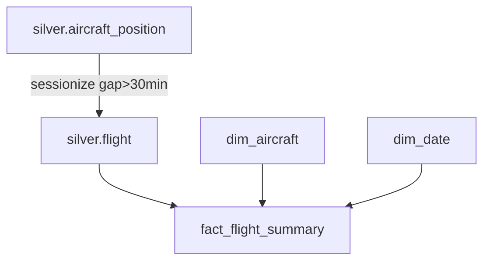

# ADR 022 — Flight-Leg Fact (`fact_flight_summary`), Derived by Sessionization; Partially Revisits ADR 009

**Status:** Proposed
**Date:** 2026-07-15
**Partially supersedes:** ADR 009 (lifts the "no `fact_flights`" clause for a *derived* leg fact only; States/positions as the central fact still holds)
**Builds on:** ADR 020 (Redshift warehouse), ADR 021 (incremental loader)

---

## Context

ADR 009 fixed the Silver model as "positions as the central fact" and explicitly rejected a
`fact_flights` / `fact_delays` table. That reasoning was about **scheduled-airline** facts —
origin/destination, delays — which the raw feed does not carry.

Building the Redshift warehouse (ADR 020) surfaced a second, useful grain that ADR 009 did not
consider: a **flight leg**, derived *from the positions we already store* by sessionization
(group consecutive pings for the same `icao24` + `callsign`, split on a > 30 min gap). This is
a rollup of existing data — first/last seen, duration, position count, altitude/speed maxima —
not scheduled-flight or delay data.

A leg fact makes common questions cheap (flights per day, per-aircraft utilisation, busiest
callsigns) without scanning the high-volume position fact.

## Decision

1. Add **`silver.flight`** (grain = one flight leg) derived from `silver.aircraft_position` by
   sessionization, and **`gold.fact_flight_summary`** (an accumulating-snapshot fact) built
   from it. Both keyed on `flight_bk = md5(icao24 | callsign | window_start)`.
2. `fact_flight_summary` is a **conformed-dimension** fact: it shares `gold.dim_aircraft` and
   `gold.dim_date` with `fact_aircraft_position` (a galaxy / fact-constellation schema).
3. Legs are **recomputed over a rolling 2-day window** each run and **replaced** (delete+insert
   of recomputed `flight_bk`s), so a still-open leg's `window_end`/measures update until its
   gap closes (`etl/sql/load_incremental.sql`, step 4).

## Rationale

- **Not a reversal of ADR 009's intent.** ADR 009 rejected *scheduled-flight/delay* facts on
  data-availability grounds. `fact_flight_summary` is a **derived position-rollup** — strictly
  narrower, and buildable purely from data we already hold. This mirrors the ADR 014 precedent,
  where ADR 009 was partially superseded for a specific, justified case.
- **No new source.** Legs come from `silver.aircraft_position`; no route/airport data is
  invented (adsb positions carry none — `dim_airports` remains out of scope).
- **Accumulating snapshot fits the grain.** A leg is open while the aircraft keeps broadcasting;
  recompute-and-replace over a rolling window is the simplest correct way to let open legs
  settle, and stays idempotent via the deterministic `flight_bk`.

## Consequences

- Two facts now share `dim_aircraft`/`dim_date` — a genuine conformed-dimension setup.
- `callsign` is unstable (reused daily), so `flight_bk` includes `window_start` to keep legs
  distinct across days; the leg fact is keyed on the surrogate business key, not the callsign.
- The 2-day recompute window is a tunable: long enough to close normal legs, short enough to
  bound the sessionization scan.
- ADR 009 remains correct on everything except the one "no `fact_flights`" clause, which this
  ADR lifts **only** for the derived leg fact. Scheduled-flight/delay facts are still out.

## Related

- [ADR 009](009-states-api-silver-model.md), [ADR 014](014-adsb-lol-silver-fallback.md), [ADR 020](020-redshift-serverless-warehouse.md), [ADR 021](021-incremental-idempotent-silver-history.md)
