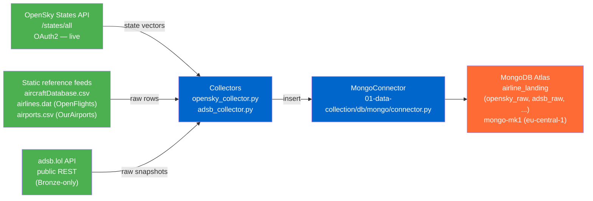
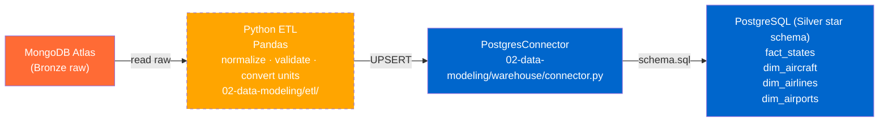
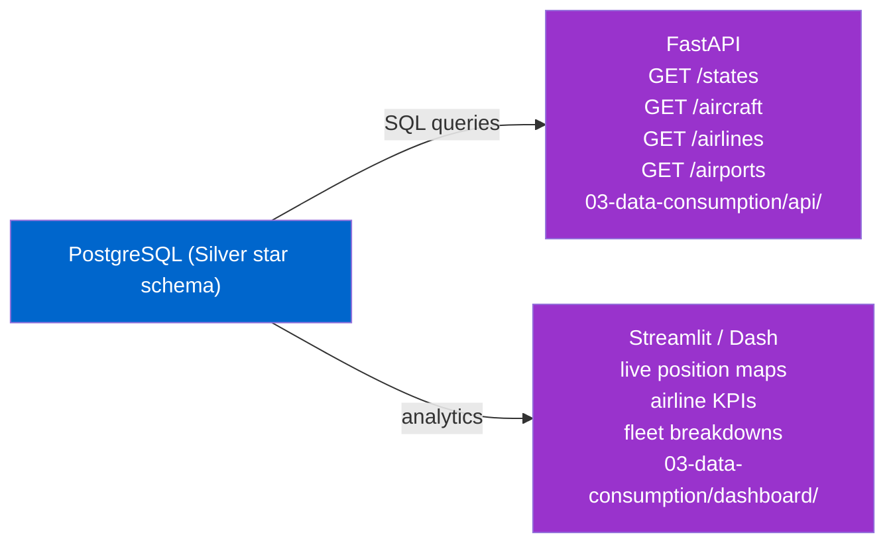
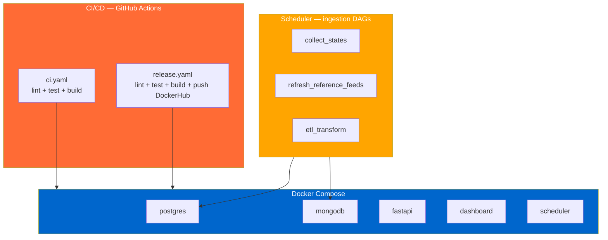
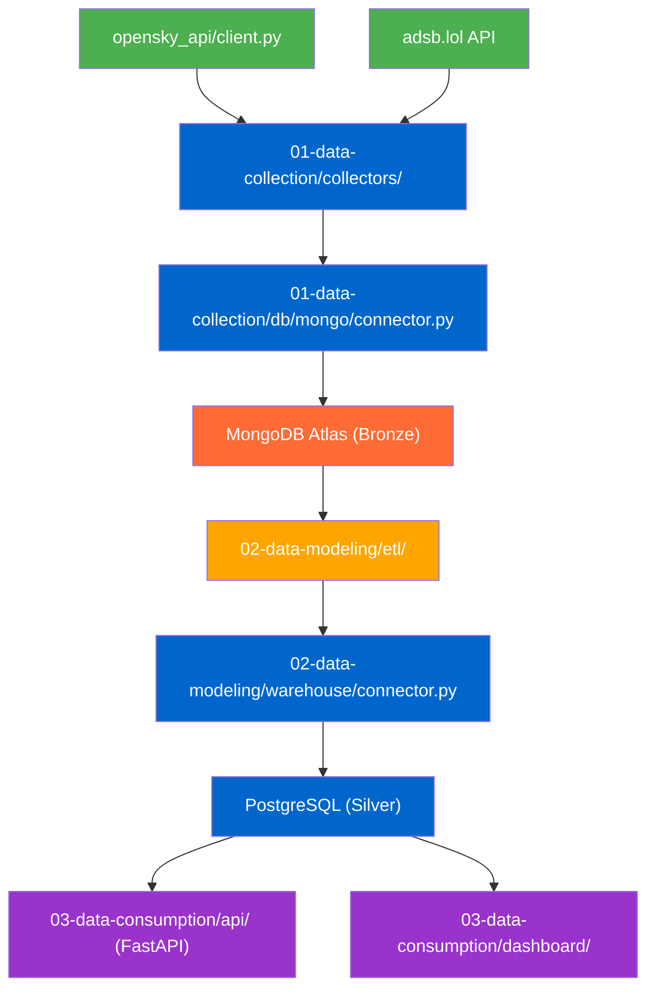
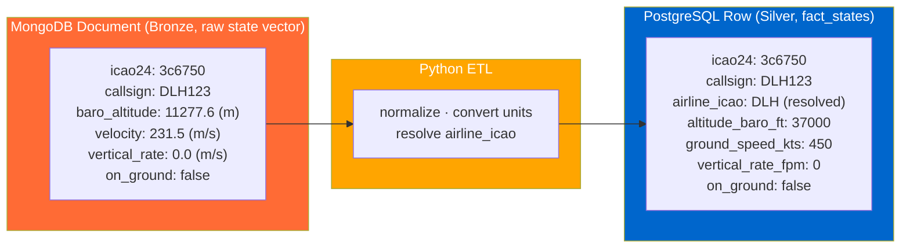

# Architecture

The platform follows a **medallion** structure: Bronze (raw landing zone, MongoDB Atlas) → Silver
(curated star schema, PostgreSQL) → Gold (deferred). The phases below map onto the repo's folder
layout: `01-data-collection` (Bronze) → `02-data-modeling` (Silver) → `03-data-consumption`
(API + dashboard) → `04-deployment`.

**Related:**
- [data-flow.md](data-flow.md) — prose explanation of data flow
- [silver-layer-er.md](silver-layer-er.md) — Silver-layer ER diagram (relational model)
- [../adr/](../adr/) — Architecture Decision Records (why)
- [../requirements/timeline.md](../requirements/timeline.md) — deadlines

---

## Phase 1 — Data Collection (Bronze) 🚧
*Folder: `01-data-collection/`*

Ingest every source **raw, untransformed** into the MongoDB Atlas landing zone. *Ingestion ≠
modeling* (ADR 004): Bronze keeps the original payloads; the Silver model promotes only what it needs.
The central live feed is OpenSky **`/states/all`** state vectors; static reference feeds and adsb.lol
land alongside it.

**What exists now:**
- `01-data-collection/opensky_api/client.py` — OpenSky client (OAuth2)
- `01-data-collection/collectors/opensky_collector.py` — OpenSky States collector ✅
- `01-data-collection/collectors/adsb_collector.py` — adsb.lol collector (Bronze-only) ✅
- `01-data-collection/db/mongo/connector.py` — MongoDB Atlas connector ✅
- `airline_landing` collections live on Atlas ✅

> **adsb.lol is Bronze-only** — collected raw for optionality and a later OpenSky-vs-adsb.lol
> data-quality comparison, **not promoted** to Silver (see [ADR 009](../adr/009-states-api-silver-model.md)).
> The retrospective OpenSky `/flights/*` model was dropped in favour of the live States feed.

---

## Phase 2 — Data Modeling (Silver) 🚧
*Folder: `02-data-modeling/`*

ETL from the Bronze landing zone into a curated PostgreSQL **star schema**. The central fact is
`fact_states` (live "aircraft in the air" from `/states/all`); dimensions come from the static
reference feeds. Only **OpenSky** (States + AircraftDB) is promoted; adsb.lol stays in Bronze.

**What exists now:**
- `02-data-modeling/warehouse/connector.py` — PostgreSQL connector ✅
- `02-data-modeling/warehouse/schema.sql` — star-schema DDL (in sync with [silver-layer-er.md](silver-layer-er.md)) ✅

**What is pending:**
- `02-data-modeling/etl/` — ETL pipeline: Bronze (Mongo) → Silver `fact_states` + dims

> **Silver tables** (see [silver-layer-er.md](silver-layer-er.md), [ADR 008](../adr/008-airline-attribution-star-schema.md), [ADR 009](../adr/009-states-api-silver-model.md)):
> `fact_states` (OpenSky `/states/all`), `dim_aircraft` (OpenSky AircraftDB, join on `icao24`),
> `dim_airlines` (OpenFlights, join on resolved `airline_icao`), `dim_airports` (OurAirports,
> **standalone reference, unjoined**). No `fact_flights` / `fact_delays`: the live States feed has no
> origin/destination and no scheduled-vs-actual times, so route from/to and delay analytics are out
> of scope for Silver.

---

## Phase 3 — Data Consumption (API & Dashboard)
*Folder: `03-data-consumption/`*

Expose the Silver star schema via FastAPI and visualize it. Endpoints and dashboard views are
position/aircraft/airline-centric — there is no route or delay analytics in this model.

**What exists now:**
- `03-data-consumption/dashboard/` — Streamlit dashboard ✅

**What will be added:**
- `03-data-consumption/api/` — FastAPI service (`/states`, `/aircraft`, `/airlines`, `/airports`)

> **Endpoint scope** (see [data-flow.md](data-flow.md)): `/states` (live positions, backed by
> `fact_states`), `/aircraft` (`dim_aircraft`), `/airlines` (`dim_airlines`), `/airports`
> (`dim_airports`, standalone). Route from/to and delay endpoints are out of scope — the live States
> feed has no origin/destination or scheduled times.

---

## Phase 4 — Deployment & Automation
*Folder: `04-deployment/`*

Containerize everything. Automate ingestion. Add CI/CD.

**What will be added:**
- `04-deployment/` — Dockerfiles, docker-compose.yml, GitHub Actions, scheduler

---

## Technical Details

### Entity Relationship Diagram

Moved to [silver-layer-er.md](silver-layer-er.md).

---

### File Dependencies

---

### Bronze → Silver Transformation (`fact_states`)

The core ETL step: a raw OpenSky `/states/all` state vector (Bronze) becomes a `fact_states` row
(Silver), with SI → aviation unit conversion and a resolved `airline_icao` (see [ADR 008](../adr/008-airline-attribution-star-schema.md)).

> Unit conversions: m → ft (×3.281), m/s → kt (×1.944), m/s → fpm (×196.85).
> `airline_icao = COALESCE(dim_aircraft.operator_icao, callsign_prefix(callsign))`.
