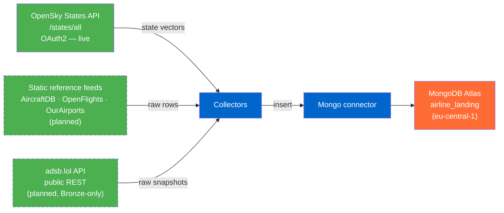
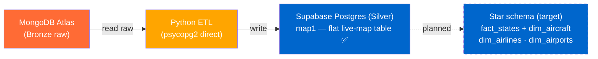
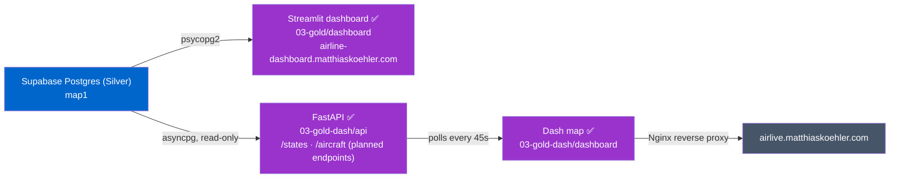
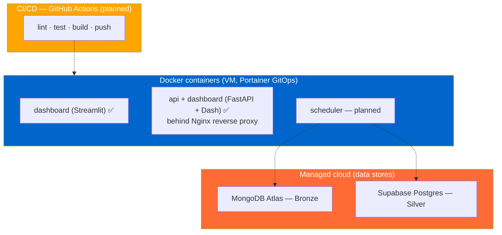
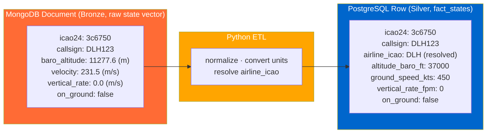

# Architecture

The platform follows a **medallion** structure: Bronze (raw landing zone, MongoDB Atlas) → Silver
(Supabase Postgres — currently the flat `map1` MVP table; curated star schema is the target) → Gold
(consumption layer: API + dashboard; dedicated Gold aggregates deferred). This folder describes the
*design and the why*; the pipeline code lives in the top-level code modules, each with its own README.

**Related:**
- [silver-layer-er.md](silver-layer-er.md) — Silver-layer ER diagram (relational model)
- [../adr/](../adr/) — Architecture Decision Records (why)
- [../requirements/timeline.md](../requirements/timeline.md) — deadlines

---

## Phase 1 — Data Collection (Bronze) 🚧

Ingest every source **raw, untransformed** into the MongoDB Atlas landing zone. *Ingestion ≠
modeling* (ADR 004): Bronze keeps the original payloads; the Silver model promotes only what it needs.
The central live feed is OpenSky **`/states/all`** state vectors; adsb.lol and static reference feeds
are planned alongside it.

> **adsb.lol is Bronze-only** — intended for optionality and a later OpenSky-vs-adsb.lol
> data-quality comparison, **not promoted** to Silver (see [ADR 009](../adr/009-states-api-silver-model.md)).
> The retrospective OpenSky `/flights/*` model was dropped in favour of the live States feed.

---

## Phase 2 — Data Modeling (Silver) 🚧

ETL from the Bronze landing zone into the **Silver** layer on Supabase Postgres. **Current state is a
lean MVP:** the ETL flattens the latest raw OpenSky snapshot into a single table **`map1`** (raw
values, no dimensions) that backs the live-map dashboard. The curated **star schema** (`fact_states` +
dims) is the *target* model ([silver-layer-er.md](silver-layer-er.md)), not yet built. Only **OpenSky**
(States + AircraftDB) is promoted; adsb.lol stays in Bronze.

**Pending — promote the `map1` MVP to the star schema:** unit conversion (m→ft, m/s→kt, m/s→fpm),
`airline_icao` resolution, dimension loaders, and `fact_states` instead of `map1`.

> **Silver tables** (see [silver-layer-er.md](silver-layer-er.md), [ADR 008](../adr/008-airline-attribution-star-schema.md), [ADR 009](../adr/009-states-api-silver-model.md)):
> `fact_states` (OpenSky `/states/all`), `dim_aircraft` (OpenSky AircraftDB, join on `icao24`),
> `dim_airlines` (OpenFlights, join on resolved `airline_icao`), `dim_airports` (OurAirports,
> **standalone reference, unjoined**). No `fact_flights` / `fact_delays`: the live States feed has no
> origin/destination and no scheduled-vs-actual times, so route from/to and delay analytics are out
> of scope for Silver.

---

## Phase 3 — Data Consumption (API & Dashboard)

Expose the Silver layer and visualize it. Endpoints and dashboard views are
position/aircraft/airline-centric — there is no route or delay analytics in this model.

**Two independent Gold-layer implementations run side by side**, each its own Cloudflare Tunnel
subdomain — not a planned/built split, but two parallel, fully working stacks:

> **`03-gold/dashboard`** — Streamlit, queries `map1` directly via psycopg2, deployed via
> `deployment/dashboard.yml` (Portainer GitOps), exposed at `airline-dashboard.matthiaskoehler.com`.
> **`03-gold-dash/`** — read-only FastAPI service (`api/`, asyncpg/Supavisor session pooler) +
> Dash frontend (`dashboard/`, polls the API every 45s) behind an Nginx reverse proxy on the same
> VM, exposed at `airlive.matthiaskoehler.com`. Endpoint scope for both: positions/aircraft/airline
> only — no route or delay analytics, since the live States feed has no origin/destination or
> scheduled times.

---

## Phase 4 — Deployment & Automation

Data stores are **managed cloud services** (MongoDB Atlas, Supabase Postgres); the application
services run as **Docker containers** on a dedicated VM, orchestrated via Portainer GitOps. Automated
ingestion scheduling and CI/CD are planned.

---

## Bronze → Silver Transformation (`fact_states`) — *target*

The core ETL step **of the target star schema** (not the current `map1` MVP, which stores raw values
without conversion): a raw OpenSky `/states/all` state vector (Bronze) becomes a `fact_states` row
(Silver), with SI → aviation unit conversion and a resolved `airline_icao` (see [ADR 008](../adr/008-airline-attribution-star-schema.md)).

> Unit conversions: m → ft (×3.281), m/s → kt (×1.944), m/s → fpm (×196.85).
> `airline_icao = COALESCE(dim_aircraft.operator_icao, callsign_prefix(callsign))`.

---

## Design principles & future options

**Design goals:** simple, reproducible, dockerized, explainable, extensible. Prefer understandable
systems and small deployable services over premature distributed systems, unnecessary cloud
complexity, or Kubernetes too early — this is a learning project.

**Future options (not in the MVP):** Kafka for streaming ingestion / real-time updates; Spark for
distributed processing of larger datasets (likely overkill at this scale); Neo4j for route-network /
airport-graph analysis. All optional extensions, deferred until a concrete need appears.
