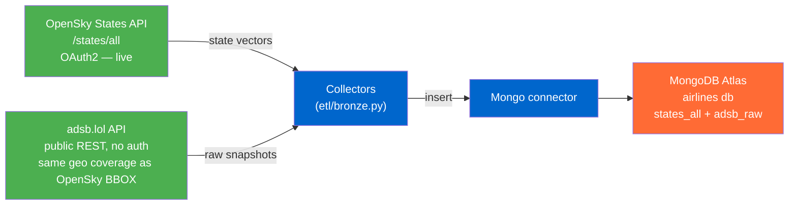
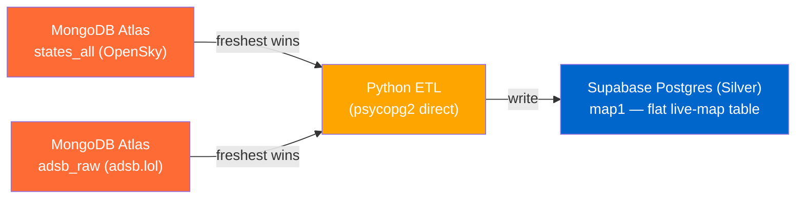
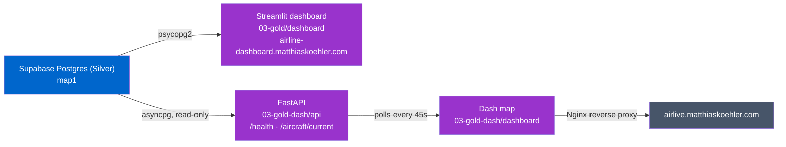
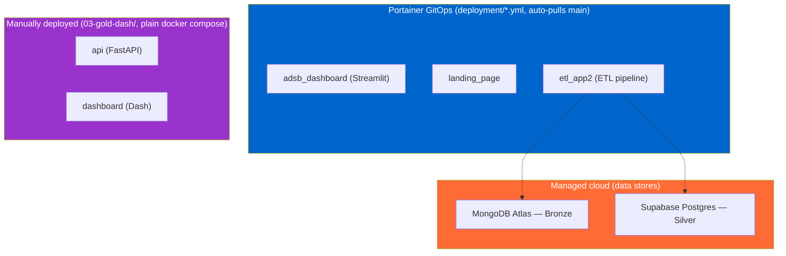
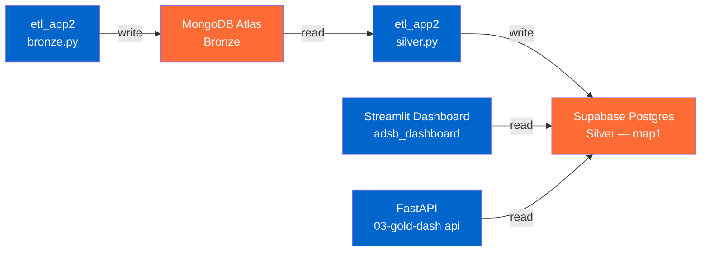
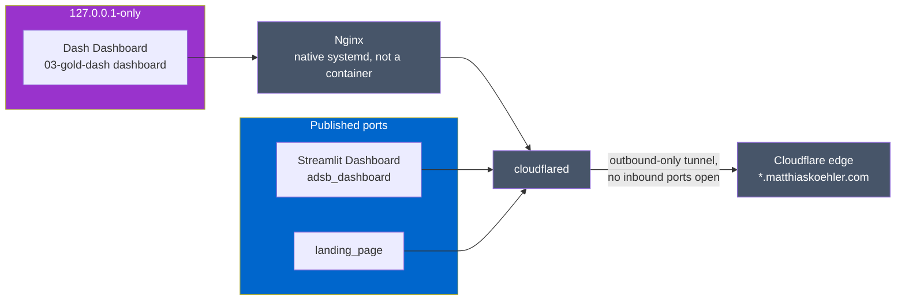

# Architecture

The platform follows a **medallion** structure: Bronze (raw landing zone, MongoDB Atlas) → Silver
(Supabase Postgres, flat `map1` table) → Gold (consumption layer: two independent dashboards). This
page describes the system **as it currently runs**; future work is tracked as draft issues in the
[GitHub Project](https://github.com/users/MatthiasSails/projects/1), not here. The pipeline code
lives in the top-level code modules, each with its own README.

**Related:**
- [silver-layer-er.md](silver-layer-er.md) — Silver-layer ER diagram (relational model)
- [../adr/](../adr/) — Architecture Decision Records (why)

---

## Bronze — Raw Landing Zone

Ingest every source **raw, untransformed** into the MongoDB Atlas landing zone. *Ingestion ≠
modeling* (ADR 004): Bronze keeps the original payloads; the Silver model promotes only what it
needs. Two live feeds run every Bronze cycle (`etl/bronze.py`): OpenSky `/states/all` (the
preferred, richer source) and adsb.lol (no-auth secondary source, same geo coverage as the OpenSky
BBOX).

> adsb.lol started Bronze-only for data-quality reasons ([ADR 009](../adr/009-states-api-silver-model.md))
> but is now also used as a Silver fallback, writing to its own `adsb_raw` collection — see Silver
> below and [ADR 014](../adr/014-adsb-lol-silver-fallback.md).
> The retrospective OpenSky `/flights/*` model was dropped in favour of the live States feed.

---

## Silver — Normalized Layer

ETL from the Bronze landing zone into the **Silver** layer on Supabase Postgres
(`etl/silver.py`). The ETL flattens the latest raw snapshot into a single table **`map1`** (raw
values, no dimensions) that backs both Gold dashboards.

**OpenSky is the preferred source; adsb.lol is a fallback** ([ADR 014](../adr/014-adsb-lol-silver-fallback.md)).
`silver.py` picks whichever Bronze snapshot is freshest by `fetched_at`. In normal operation
that's OpenSky; on the production VM, OpenSky's egress is blocked by `opensky-network.org` and its
snapshot goes stale, so adsb.lol takes over automatically — no environment-specific branching, no
manual failover.

---

## Gold — Consumption (API & Dashboards)

**Two independent Gold-layer implementations run side by side**, each its own Cloudflare Tunnel
subdomain — two parallel, fully working stacks, both reading the same `map1` table:

> **`03-gold/dashboard`** — Streamlit, queries `map1` directly via psycopg2, deployed via
> `deployment/dashboard.yml` (Portainer GitOps), exposed at `airline-dashboard.matthiaskoehler.com`.
> **`03-gold-dash/`** — read-only FastAPI service (`api/`, asyncpg/Supavisor session pooler) +
> Dash frontend (`dashboard/`, polls the API every 45s) behind an Nginx reverse proxy on the same
> VM, exposed at `airlive.matthiaskoehler.com`. Endpoint scope for both: positions/aircraft/airline
> only — no route or delay analytics, since the live States feed has no origin/destination or
> scheduled times.

---

## Deployment

Data stores are **managed cloud services** (MongoDB Atlas, Supabase Postgres); the application
services run as **Docker containers** on a dedicated VM, via **two different deployment paths** —
not by original design, just how each stack was actually rolled out.

- **Portainer GitOps** (`deployment/*.yml`) — `adsb_dashboard`, `landing_page`, `etl_app2`. Each is
  its own Portainer stack, auto-pulled from `main` (see
  [`deployment/README.md`](../../deployment/README.md)). Portainer here is purely a management
  view over the containers (equivalent to running `docker ps`/`docker compose` by hand on the VM)
  — it isn't part of the infrastructure itself, just how updates get rolled out.
- **`03-gold-dash`** (FastAPI + Dash) is **not** Portainer-managed — it's a plain `docker compose
  up` from `03-gold-dash/docker-compose.yml`, run manually on the VM, both containers bound to
  `127.0.0.1` only (see [Infrastructure](#infrastructure) for how it's exposed).

---

## Infrastructure

The actual resources — data stores, compute, network — and how they connect. Independent of which
deployment path put a given container there (see [Deployment](#deployment) above). Split into two
diagrams on purpose: one combined graph of data-store connections *and* network exposure becomes an
unreadable tangle of crossing lines, so **data connectivity** and **network exposure** are shown
separately.

### Data connectivity

- **MongoDB Atlas** (Bronze) — written only by `etl_app2`, via SRV connection string. Nothing
  currently reads it back out.
- **Supabase Postgres** (Silver, `map1`) — three readers/writers, **two different connection
  strategies** against the Direct Connection (port 5432, IPv6-only): `adsb_dashboard` and
  `etl_app2` connect directly (`adsb_dashboard` via `network_mode: host`); `03-gold-dash api` uses
  the **Supavisor session pooler** instead (IPv4-compatible) — see `03-gold-dash/README.md`.

### Network exposure

- **Nginx runs natively on the VM** (systemd service, not a container) and is the only entry point
  for `03-gold-dash` — reverse-proxies `127.0.0.1:8050` out to `airlive.matthiaskoehler.com`.
  Installed manually per `03-gold-dash/README.md`, not pulled by GitOps.
- **Cloudflare Tunnel** (`cloudflared`) makes an outbound-only connection to the Cloudflare edge;
  no inbound ports are open on the VM. The edge maps each subdomain (`airline-dashboard.`,
  `airlive.`, `airline.`) to the matching local service.

