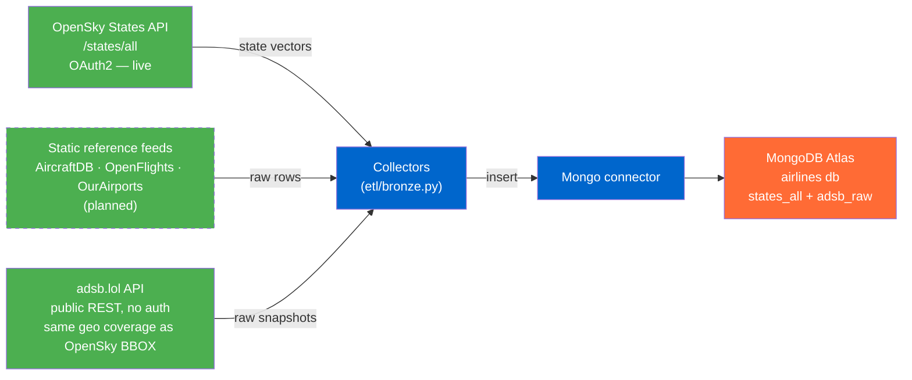
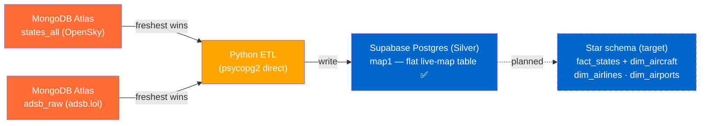
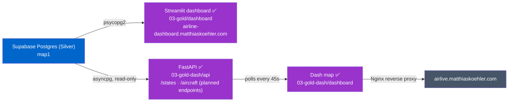
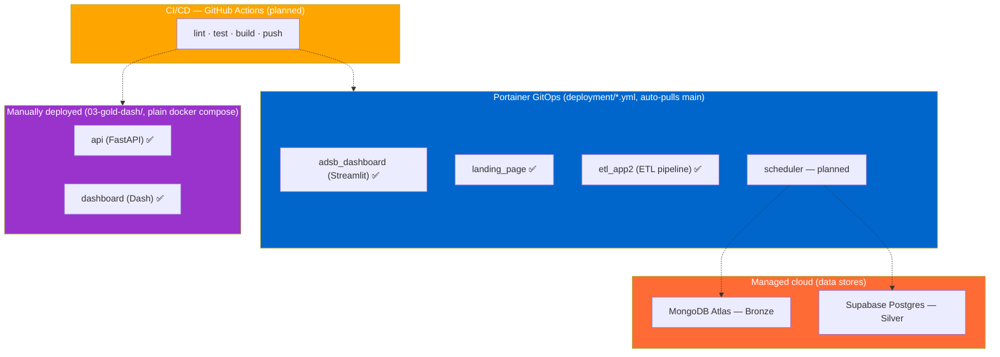
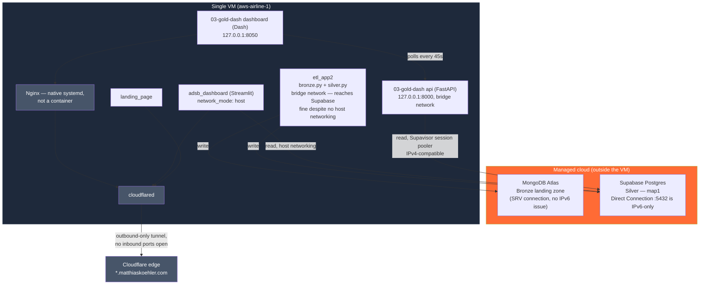
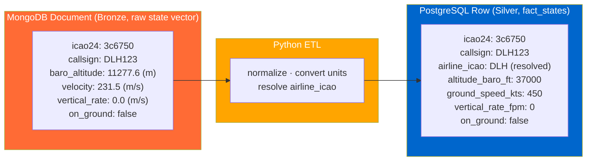

# Architecture

The platform follows a **medallion** structure: Bronze (raw landing zone, MongoDB Atlas) → Silver
(Supabase Postgres — currently the flat `map1` MVP table; curated star schema is the target) → Gold
(consumption layer: two independent dashboards). This page describes the system **as it currently
runs**; the [Roadmap](#roadmap--pending) section at the end lists what's still ahead. The pipeline
code lives in the top-level code modules, each with its own README.

**Related:**
- [silver-layer-er.md](silver-layer-er.md) — Silver-layer ER diagram (relational model)
- [../adr/](../adr/) — Architecture Decision Records (why)

---

## Bronze — Raw Landing Zone

Ingest every source **raw, untransformed** into the MongoDB Atlas landing zone. *Ingestion ≠
modeling* (ADR 004): Bronze keeps the original payloads; the Silver model promotes only what it
needs. Two live feeds run every Bronze cycle (`etl/bronze.py`): OpenSky `/states/all` (the
preferred, richer source) and adsb.lol (no-auth secondary source, same geo coverage as the OpenSky
BBOX). Static reference feeds (AircraftDB, OpenFlights, OurAirports) are still planned.

> adsb.lol started Bronze-only for data-quality reasons ([ADR 009](../adr/009-states-api-silver-model.md))
> but is now also used as a Silver fallback — see Silver below and [ADR 014](../adr/014-adsb-lol-silver-fallback.md).
> The retrospective OpenSky `/flights/*` model was dropped in favour of the live States feed.

---

## Silver — Normalized Layer

ETL from the Bronze landing zone into the **Silver** layer on Supabase Postgres
(`etl/silver.py`). **Current state is a lean MVP:** the ETL flattens the latest raw snapshot into a
single table **`map1`** (raw values, no dimensions) that backs both Gold dashboards. The curated
**star schema** (`fact_states` + dims) is the *target* model
([silver-layer-er.md](silver-layer-er.md), see [Roadmap](#roadmap--pending)) — not yet built.

**OpenSky is the preferred source; adsb.lol is a fallback** ([ADR 014](../adr/014-adsb-lol-silver-fallback.md)).
`silver.py` picks whichever Bronze snapshot is freshest by `fetched_at`. In normal operation
that's OpenSky; on the production VM, OpenSky's egress is blocked by `opensky-network.org` and its
snapshot goes stale, so adsb.lol takes over automatically — no environment-specific branching, no
manual failover. This fallback applies to the `map1` MVP only; the target `fact_states` model below
is still OpenSky-States-centric per ADR 009 and will need revisiting once that model is built.

> **Target Silver tables** (see [silver-layer-er.md](silver-layer-er.md), [ADR 008](../adr/008-airline-attribution-star-schema.md), [ADR 009](../adr/009-states-api-silver-model.md)):
> `fact_states` (OpenSky `/states/all`), `dim_aircraft` (OpenSky AircraftDB, join on `icao24`),
> `dim_airlines` (OpenFlights, join on resolved `airline_icao`), `dim_airports` (OurAirports,
> **standalone reference, unjoined**). No `fact_flights` / `fact_delays`: the live States feed has no
> origin/destination and no scheduled-vs-actual times, so route from/to and delay analytics are out
> of scope for Silver.

---

## Gold — Consumption (API & Dashboards)

**Two independent Gold-layer implementations run side by side**, each its own Cloudflare Tunnel
subdomain — not a planned/built split, but two parallel, fully working stacks, both reading the
same `map1` table:

> **`03-gold/dashboard`** — Streamlit, queries `map1` directly via psycopg2, deployed via
> `deployment/dashboard.yml` (Portainer GitOps), exposed at `airline-dashboard.matthiaskoehler.com`.
> **`03-gold-dash/`** — read-only FastAPI service (`api/`, asyncpg/Supavisor session pooler) +
> Dash frontend (`dashboard/`, polls the API every 45s) behind an Nginx reverse proxy on the same
> VM, exposed at `airlive.matthiaskoehler.com`. Endpoint scope for both: positions/aircraft/airline
> only — no route or delay analytics, since the live States feed has no origin/destination or
> scheduled times.

---

## Deployment

Data stores are **managed cloud services** (MongoDB Atlas, Supabase Postgres); the application
services run as **Docker containers** on a dedicated VM, via **two different deployment paths** —
not by original design, just how each stack was actually rolled out. Automated ingestion
scheduling and CI/CD are still planned (see [Roadmap](#roadmap--pending)).

- **Portainer GitOps** (`deployment/*.yml`) — `adsb_dashboard`, `landing_page`, `etl_app2`. Each is
  its own Portainer stack, auto-pulled from `main` (see
  [`deployment/README.md`](../../deployment/README.md)). Portainer here is purely a management
  view over the containers (equivalent to running `docker ps`/`docker compose` by hand on the VM)
  — it isn't part of the infrastructure itself, just how updates get rolled out.
- **`03-gold-dash`** (FastAPI + Dash) is **not** Portainer-managed — it's a plain `docker compose
  up` from `03-gold-dash/docker-compose.yml`, run manually on the VM, both containers bound to
  `127.0.0.1` only (see [Infrastructure](#infrastructure) for how it's exposed).

---

## Infrastructure

The actual resources — data stores, compute, network — and how they connect. Independent of which
deployment path put a given container there (see [Deployment](#deployment) above).

- **MongoDB Atlas** (Bronze) — written only by `etl_app2`, via SRV connection string (no IPv6
  dependency). Nothing currently reads it back out (the notebooks that used to are gone, #16).
- **Supabase Postgres** (Silver, `map1`) — three independent connections, **two different
  connection strategies**, both confirmed working on the VM despite `docker-compose.yml`
  (`etl_app2`) not setting `network_mode: host` the way `dashboard.yml` does:
  - `adsb_dashboard` (host networking, by design — see `dashboard.yml`'s comment block) and
    `etl_app2` (plain bridge network) both reach the Direct Connection (port 5432) successfully;
    `etl_app2`'s logs confirm repeated successful `map1` writes from inside its bridge-networked
    container, so the IPv6-bridge concern documented for the dashboard doesn't block it in
    practice.
  - `03-gold-dash api` uses the **Supavisor session pooler** (IPv4-compatible) instead — see
    `03-gold-dash/README.md`.
- **`etl_app2` has no restart policy** (`docker-compose.yml` lacks `restart:`, unlike
  `dashboard.yml`'s `unless-stopped`). A single unhandled exception in `bronze.py`/`silver.py` (any
  uncaught error — e.g. a Postgres `statement_timeout`) makes `run_pipeline.sh` exit (`set -e`),
  which stops the container for good with no automatic recovery. This has happened in production:
  the container sat `Exited (1)` for 3 days (2026-06-27 → 2026-06-30) before being noticed and
  manually restarted — `map1` silently went stale for that entire window. Fix tracked separately
  (`fix/etl-restart-policy`).
- **Nginx runs natively on the VM** (systemd service, not a container) and is the only entry point
  for `03-gold-dash` — reverse-proxies `127.0.0.1:8050` out to `airlive.matthiaskoehler.com`.
  Installed manually per `03-gold-dash/README.md`, not pulled by GitOps.
- **Cloudflare Tunnel** (`cloudflared`) makes an outbound-only connection to the Cloudflare edge;
  no inbound ports are open on the VM. The edge maps each subdomain (`airline-dashboard.`,
  `airlive.`, `airline.`) to the matching local service.

---

## Target Bronze → Silver Transformation (`fact_states`)

The core ETL step **of the target star schema** (not the current `map1` MVP, which stores raw
values without conversion): a raw OpenSky `/states/all` state vector (Bronze) becomes a
`fact_states` row (Silver), with SI → aviation unit conversion and a resolved `airline_icao` (see
[ADR 008](../adr/008-airline-attribution-star-schema.md)).

> Unit conversions: m → ft (×3.281), m/s → kt (×1.944), m/s → fpm (×196.85).
> `airline_icao = COALESCE(dim_aircraft.operator_icao, callsign_prefix(callsign))`.

---

## Roadmap / Pending

- **Star schema promotion** — `fact_states` + `dim_aircraft`/`dim_airlines`/`dim_airports` instead
  of the flat `map1` MVP: unit conversion, `airline_icao` resolution, dimension loaders.
- **Silver fallback re-evaluation** — the OpenSky/adsb.lol "freshest wins" fallback ([ADR 014](../adr/014-adsb-lol-silver-fallback.md))
  covers `map1` only; needs a decision once `fact_states` is built.
- **Static reference feeds** (AircraftDB, OpenFlights, OurAirports) — not yet ingested into Bronze.
- **Scheduler** — automated ingestion cadence (currently manual/cron-equivalent via `run_pipeline.sh`).
- **CI/CD** — GitHub Actions (lint · test · build · push), not yet set up.

---

## Design principles & future options

**Design goals:** simple, reproducible, dockerized, explainable, extensible. Prefer understandable
systems and small deployable services over premature distributed systems, unnecessary cloud
complexity, or Kubernetes too early — this is a learning project.

**Future options (not in the MVP):** Kafka for streaming ingestion / real-time updates; Spark for
distributed processing of larger datasets (likely overkill at this scale); Neo4j for route-network /
airport-graph analysis. All optional extensions, deferred until a concrete need appears.
