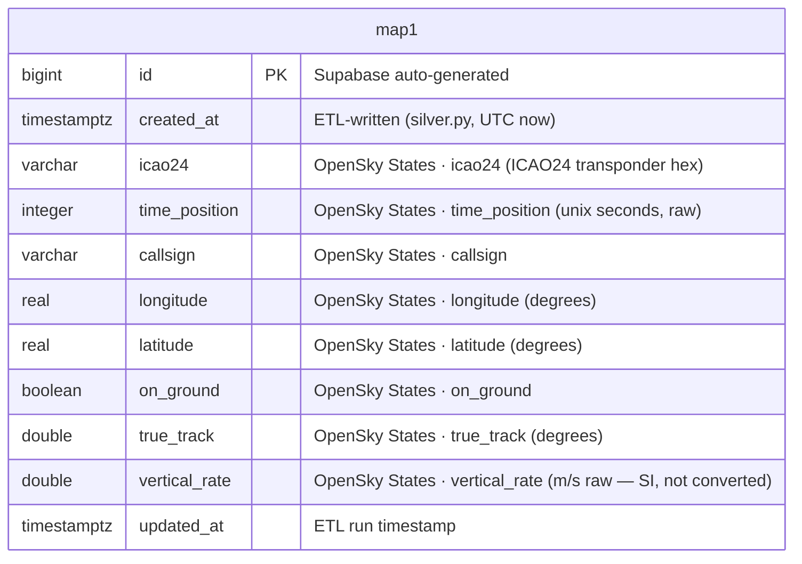

# Silver-Layer ER Diagram — Relational Model

PostgreSQL warehouse — **Silver layer** (curated / relational).

**Deployed:** `map1` (Supabase, since 2026-06-09). The target star schema
(`fact_states` + `dim_aircraft`/`dim_airlines`/`dim_airports`) is not yet built — tracked as a
draft issue ("Datawarehouse - enrich data") in the
[GitHub Project](https://github.com/users/MatthiasSails/projects/1).

> **Bronze vs. Silver:** the raw landing zone (MongoDB Atlas, Bronze) keeps *all* sources —
> OpenSky **and** adsb.lol. `map1` promotes the freshest of the two automatically
> ([ADR 014](../adr/014-adsb-lol-silver-fallback.md)). Ingestion ≠ modeling (ADR 004).

---

## `map1`

Flat table. One row per aircraft observation. No joins, no unit conversion. The table has a
surrogate `id` PK **plus** a `unique (icao24, time_position)` constraint. The current loader
(`etl/silver.py`) does a **full refresh** — `DELETE FROM map1`, then insert the latest snapshot
from whichever source is freshest (OpenSky, or adsb.lol as a fallback — [ADR 014](../adr/014-adsb-lol-silver-fallback.md))
— so the unique constraint mainly guards against duplicates within a single snapshot (it does not
use `ON CONFLICT`).

**Source of every field is shown inline** (OpenSky States field names; when adsb.lol is the active
source, `etl/silver.py`'s `map_adsb_doc()` maps its `ac[]` fields onto these same columns instead).

DDL: [`etl/sql/map1.sql`](../../etl/sql/map1.sql).
