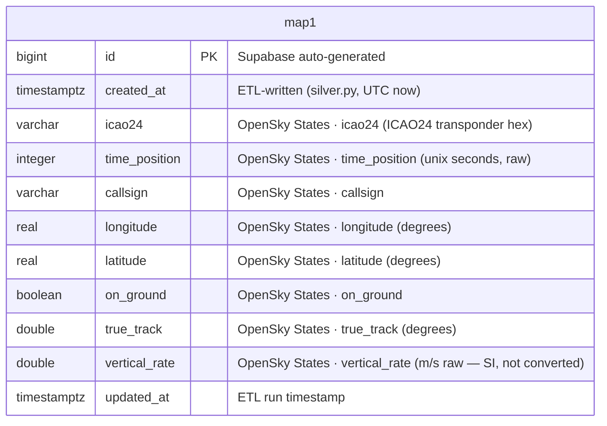
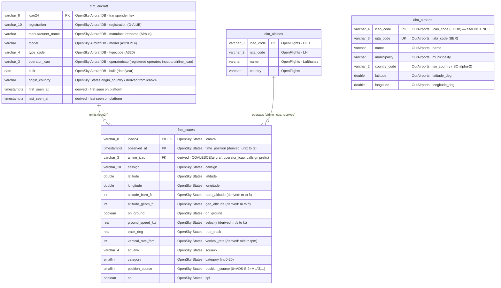

# Silver-Layer ER Diagram — Relational Model

PostgreSQL warehouse — **Silver layer** (curated / relational).

Two stages:

| Stage | Table(s) | Status |
|---|---|---|
| **MVP** | `map1` | ✅ deployed (Supabase, 2026-06-09) |
| **Step 3 — Star Schema** | `fact_states`, `dim_aircraft`, `dim_airlines`, `dim_airports` | planned |

> **Bronze vs. Silver:** the raw landing zone (MongoDB Atlas, Bronze) keeps *all* sources —
> OpenSky **and** adsb.lol. The **Stage 2 star schema** (`fact_states` + dims, below) promotes
> **only OpenSky** (States + AircraftDB) — adsb.lol is intentionally not in that diagram. The
> **Stage 1 MVP** (`map1`) is the exception: it also accepts adsb.lol as an automatic fallback when
> OpenSky's snapshot goes stale ([ADR 014](../adr/014-adsb-lol-silver-fallback.md)) — see Stage 1
> below. Ingestion ≠ modeling (ADR 004).

---

## Stage 1 — MVP: `map1` (deployed)

Flat table. One row per aircraft observation. No joins, no unit conversion. The table has a
surrogate `id` PK **plus** a `unique (icao24, time_position)` constraint. The current loader
(`etl/silver.py`) does a **full refresh** — `DELETE FROM map1`, then insert the latest snapshot
from whichever source is freshest (OpenSky, or adsb.lol as a fallback — [ADR 014](../adr/014-adsb-lol-silver-fallback.md))
— so the unique constraint mainly guards against duplicates within a single snapshot (it does not
use `ON CONFLICT`).

**Source of every field is shown inline** (OpenSky States field names; when adsb.lol is the active
source, `etl/silver.py`'s `map_adsb_doc()` maps its `ac[]` fields onto these same columns instead).

**Known gaps vs. Step 3 target** (fields available in OpenSky States but not yet stored):

| Missing field | OpenSky States index | Target column in `fact_states` |
|---|---|---|
| Barometric altitude | `s[7]` (m) | `altitude_baro_ft` (converted m→ft) |
| Geometric altitude | `s[13]` (m) | `altitude_geom_ft` (converted m→ft) |
| Ground speed | `s[9]` (m/s) | `ground_speed_kts` (converted m/s→kt) |
| Squawk | `s[14]` | `squawk` |
| Category | `s[16]` | `category` |
| Position source | `s[15]` | `position_source` |
| SPI | `s[17]` | `spi` |

Unit note: `vertical_rate` is stored as raw m/s (OpenSky SI). Step 3 converts to fpm (×196.85).

---

## Stage 2 — Star Schema: `fact_states` + dims (Step 3, planned)

**The source of every field is shown inline** in each attribute's comment. See legend.

**Modeling terminology & naming:**

| Layer | Tables | Classification | Why |
|---|---|---|---|
| **Fact / event** | `fact_states` | transactional / *Bewegungsdaten*, high-volume, append-only | live observations, timestamped |
| **Dimensions** | `dim_aircraft`, `dim_airlines` (joined to fact); `dim_airports` (standalone reference, unjoined) | **reference data** (not master data) | externally standardized, slowly changing, *imported* not *authored* |

> Names carry a `fact_` / `dim_` prefix (Kimball convention) so the modeling role is visible
> at a glance. **Live vs. historical is *not* encoded in names** — recency lives in the
> `observed_at` column (`WHERE observed_at > now() - interval '5 min'`), volume is handled by
> time-partitioning. A "latest position per aircraft" optimization would be a separate
> materialized view (e.g. `aircraft_current_state`), not part of this core model.

**Data sources:**

| Tag in diagram | Source | Type | Notes |
|---|---|---|---|
| **OpenSky States** | OpenSky `/states/all` | live (OAuth2) | state vectors → `fact_states` |
| **OpenSky AircraftDB** | OpenSky `aircraftDatabase.csv` (free download) | static reference | `dim_aircraft` — icao24→registration/type/operator; community-maintained; terms: research/non-commercial |
| **OurAirports** | OurAirports `airports.csv` (~12 MB, public domain) | static reference | `dim_airports` — icao_code/iata_code/coords; ~85k rows, filtered to those with icao_code (ADR 004) |
| **OpenFlights** | OpenFlights `airlines.dat` (GitHub raw, ODbL, free) | static reference | airlines — ⚠ snapshot **last updated 2017**, post-2017 airlines stale/missing |
| **derived** | computed in ETL | — | not a raw API field (conversion / lookup) |
| *(Bronze only)* | *adsb.lol API* | *live (public)* | *raw landing zone only — not promoted to this Silver model* |

> **Canonical units = aviation (ft, kt, ft/min).** OpenSky States is the only feed and reports SI;
> values are converted in ETL (m → ft ×3.281, m/s → kt ×1.944, m/s → fpm ×196.85).

---

## Diagram legend (ER notation)

How to read the diagram — key markers and crow's-foot cardinality:

| Marker | Meaning |
|---|---|
| **PK** | Primary key (uniquely identifies a row) |
| **FK** | Foreign key (references another table's PK) |
| **UK** | Unique key (unique, but not the primary key) |
| **PK,FK** | Column is part of the primary key *and* a foreign key |
| `"..."` | Inline comment — here: **the data source** of each field |

| Connector | Cardinality | Used for |
|---|---|---|
| `||--o{` | one **→** zero-or-many, *solid* (identifying) | reliable FK join, e.g. `dim_aircraft → fact_states` |
| `||..o{` | one **→** zero-or-many, *dashed* (non-identifying) | derived / soft link (not currently used — `dim_airports` is unjoined) |

Crow's-foot symbols read left-to-right: `||` = exactly one, `o{` = zero or many.
A **solid** line is an enforced/reliable relationship; a **dashed** line is derived or heuristic
(not enforced by a DB constraint).

### Attribute row layout (the unlabeled "columns")

Each row inside an entity box has **no header** — its meaning is fixed by position. The diagram
follows **Mermaid's attribute grammar** (a Crow's-Foot / Information-Engineering style box), which
is *not* part of the original Chen ER standard:

| Position | Content | Example | Note |
|---|---|---|---|
| 1 | **data type** | `varchar_8`, `timestamptz`, `int`, `double`, `boolean`, `real` | physical SQL type |
| 2 | **column name** | `icao24`, `observed_at` | — |
| 3 | **key constraint** | `PK`, `FK`, `UK`, `PK,FK` | optional |
| 4 | **comment** | `"OpenSky icao24 / adsb.lol hex"` | optional; here = **data source** (Mermaid extension) |

> **Type notation:** Mermaid types may not contain spaces or parentheses, so `varchar_8` means
> `VARCHAR(8)`, `varchar_3` means `VARCHAR(3)`, etc. The real SQL types live in `schema.sql`.

---

## Relationship notes (Star Schema)

All dimension joins are **LEFT/outer** — a `fact_states` observation must survive even when a
dimension lookup misses (unknown aircraft, unresolved airline). Fact integrity does not depend on
dimension completeness.

- **`dim_aircraft` → `fact_states`** (solid): join on `icao24`. The shared, reliable key.
- **`dim_airlines` → `fact_states`** (solid, **star** — decided, see [ADR 008](../adr/008-airline-attribution-star-schema.md)):
  the fact carries a resolved `airline_icao` (single-hop FK), so airline analytics reflect the
  **operating airline of the flight**, not just the airframe's registered operator.
  - **Resolution rule (ETL):** `airline_icao = COALESCE(dim_aircraft.operator_icao, callsign_prefix(fact_states.callsign))`
    — registered operator first, ICAO callsign prefix (`DLH123`→`DLH`) as fallback.
  - `dim_aircraft.operator_icao` remains a *plain attribute* (the airframe's registered operator),
    an input to the resolution — no longer the fact's airline path.
- **`dim_airports`** — **standalone reference table, not joined to the fact.** States data carries
  **no origin/destination**; a "nearest airport" would be a geometric guess (the airport under a
  cruising aircraft says nothing about its route). So *from/to is unknown* in this Silver model.
  Capturing real source/destination airports is a **future Bronze-layer concern** (needs a
  scheduled-flight or flight-leg source). `dim_airports` stays available for ad-hoc geo/reporting.

## Field gotchas

- **Units** — OpenSky States reports SI (m, m/s); `map1` stores raw SI. `fact_states` converts to aviation units (ft, kt, fpm) in ETL.
- **No departure/arrival airports (from/to unknown)** — the States API model dropped OpenSky's
  retrospective `/flights/*` endpoints (not live; see ADR 003). Only live position/state is captured,
  so `dim_airports` stays unjoined; real origin/destination is deferred to the Bronze layer.
- **adsb.lol and the Stage 2 star schema** — not promoted into `fact_states`/dims (this Stage 2
  model). Aircraft metadata in `dim_aircraft` comes solely from the OpenSky AircraftDB. adsb.lol
  *is* used as a Stage 1 (`map1`) fallback — see Stage 1 above and [ADR 014](../adr/014-adsb-lol-silver-fallback.md).
- **`dim_airports` load filter** — OurAirports has ~85k rows but most (small fields, heliports,
  `closed`) carry **no `icao_code`**. Since `icao_code` is the PK (NOT NULL), the loader filters
  `WHERE icao_code IS NOT NULL` (optionally also `type IN ('large_airport','medium_airport')`).

DDL: [`etl/sql/map1.sql`](../../etl/sql/map1.sql) holds the deployed `map1` MVP table. The star-schema DDL (`fact_states` + dims) is the **target** model described above and is **not yet in the repo** (the earlier `schema.sql` draft was removed with the `02-silver/` → `etl/` restructure).
