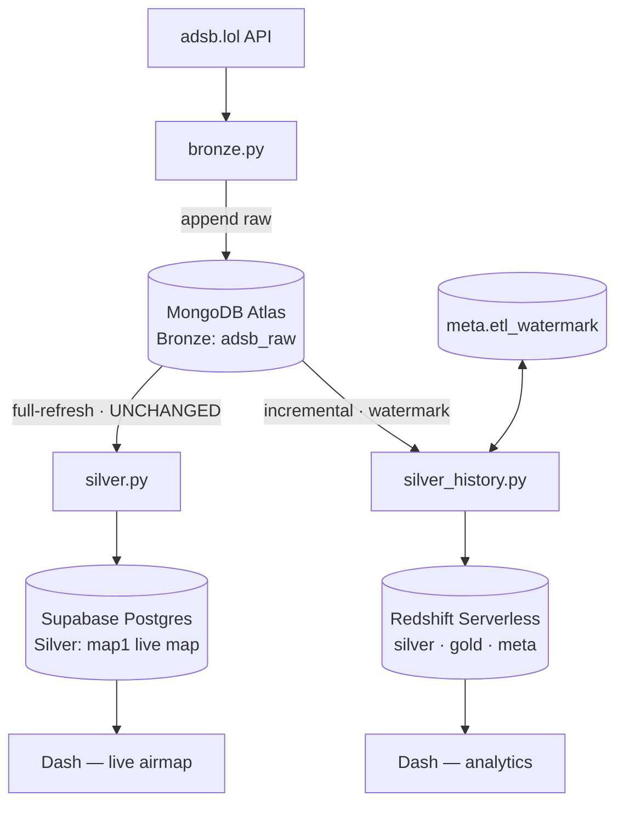
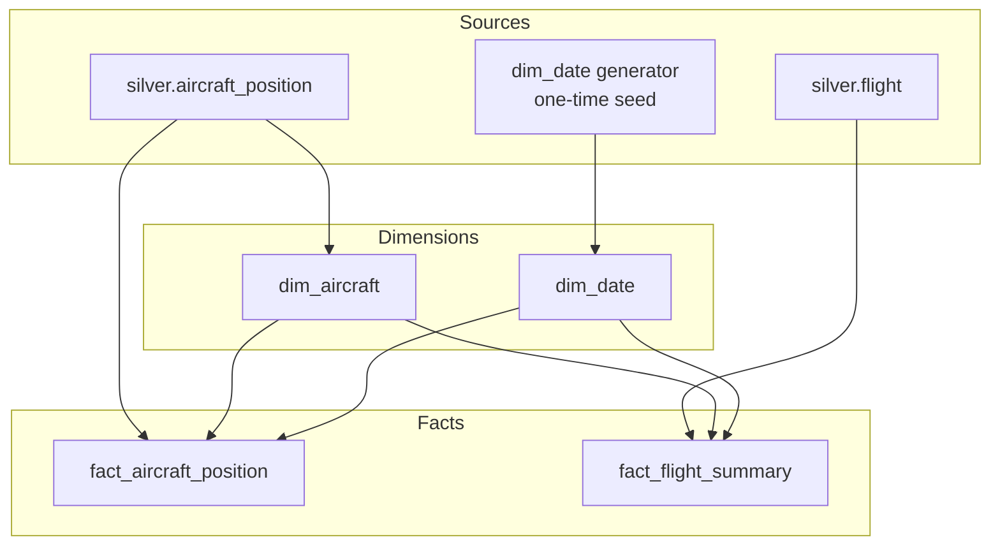
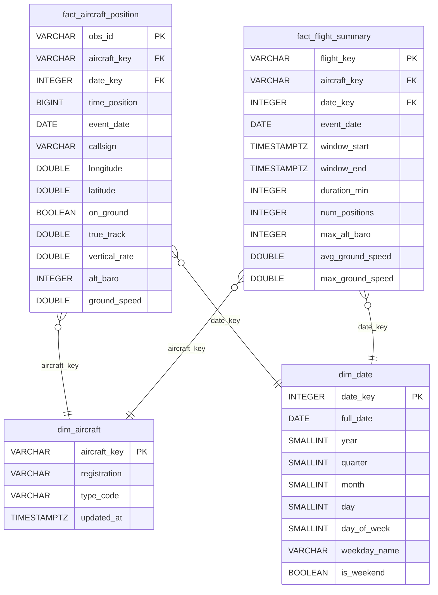
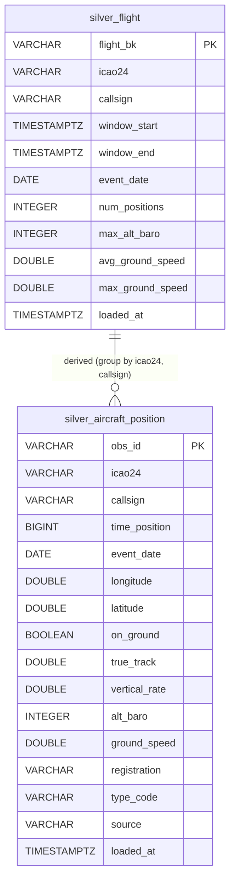
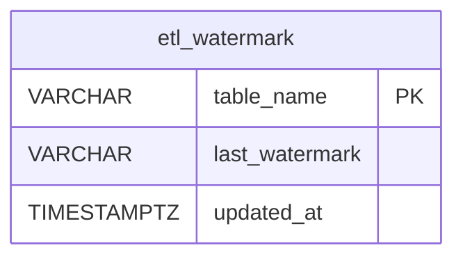

# Redshift Warehouse — Diagram Reference

Scope: adsb.lol only · Redshift Serverless · pure star (no `dim_aircraft_type`) ·
`fact_flight_summary` included (Option A).

> Temporary reference on `feature/redshift-silver-history` — to be folded into the ADRs
> (020/021/022) and `docs/architecture/` once the warehouse lands. GitHub renders the
> Mermaid below inline.

---

## 1. Medallion data flow (movement between stores)



---

## 2. Gold star-schema build (how dims + facts are assembled)



---

## 3. Gold star schema — field-level (MLD, Redshift types)



`DOUBLE` = `DOUBLE PRECISION` in the actual DDL (shortened so Mermaid parses cleanly).

---

## 4. Silver layer — field-level



The `silver_flight → silver_aircraft_position` link is a **logical derivation** (sessionization),
not a stored foreign key — `aircraft_position` carries no `flight_bk`.

---

## 5. Control table — `meta.etl_watermark`



`last_watermark` = max Bronze `fetched_at` (ISO 8601) processed — copied from Bronze so it
compares directly to Mongo's `fetched_at`. `updated_at` = loader wall-clock (audit only).

---

## 6. Idempotent incremental load (sequence)

```mermaid
sequenceDiagram
    participant Loop as Docker loop
    participant SH as silver_history.py
    participant MG as MongoDB (adsb_raw)
    participant WM as meta.etl_watermark
    participant RS as Redshift (silver + gold)

    Loop->>SH: run
    SH->>WM: SELECT last_watermark
    WM-->>SH: watermark (fetched_at)
    SH->>MG: find adsb_raw WHERE fetched_at > watermark
    MG-->>SH: new Bronze docs
    Note over SH: map_adsb_doc → rows<br/>obs_id = md5(icao24 | time_position)
    SH->>RS: load staging (temp table)
    SH->>RS: insert-if-new → silver.aircraft_position
    SH->>RS: upsert → dim_aircraft + fact_aircraft_position
    SH->>RS: sessionize → silver.flight + fact_flight_summary
    Note over RS: re-run = no-op (deterministic keys)
    SH->>WM: UPDATE last_watermark = MAX(fetched_at)
    Note over SH,WM: advanced only after success → crash-safe
```
