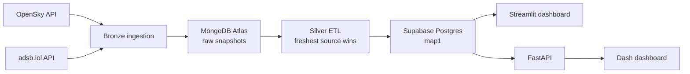
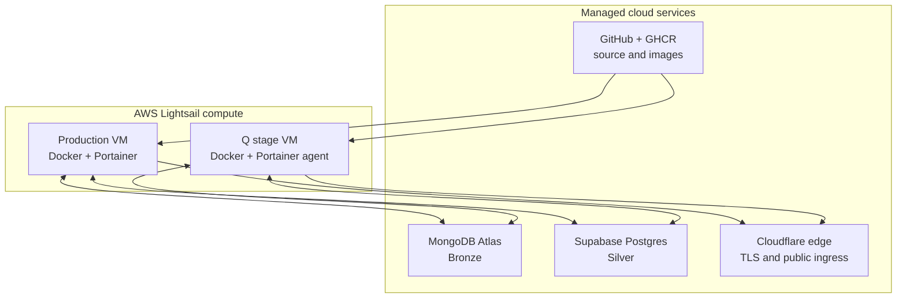
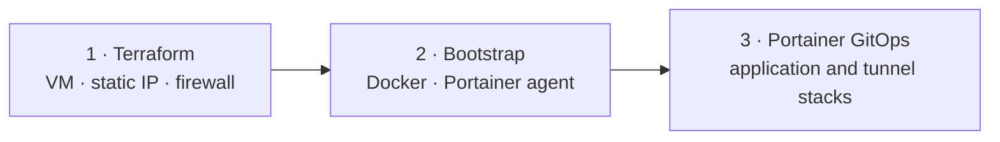
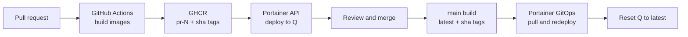

# Airline Data Engineering Platform

## A production-minded flight-data pipeline

Infrastructure · DevOps · GitOps · Databases

<!--
Slide 1 of 10
Visual direction: Minimal title slide. Use a full-width, darkened crop of the dashboard screenshot
from ../images/dashboard-screenshot.jpg if the chosen slide tool supports background images.
-->

---

# Real constraints shaped the platform

- Live aircraft data arrives from two external ADS-B APIs with different reliability and rate limits.
- The team works across multiple environments without premium data services or a large operations platform.
- The system must preserve raw input, publish a dependable live view, and remain understandable to a small team.

**Engineering objective:** automate the path from external API to deployable data product while keeping every operational layer explicit.

<!--
Slide 2 of 10
Source notes: ../../README.md; ../requirements/scope.md; ../architecture/README.md.
Narrative job: Establish why infrastructure and delivery choices matter before introducing technology.
-->

---

# A medallion pipeline separates capture, transformation, and consumption

- Bronze retains source-shaped snapshots; Silver creates a stable relational contract.
- Gold applications remain independent while reading the same curated table.
- Source failover happens in data logic, not in environment-specific infrastructure.

<!--
Slide 3 of 10
Source notes: ../architecture/README.md; ../../etl/bronze.py; ../../etl/silver.py.
Reference context: Bartosz Konieczny, Data Engineering Design Patterns, ch. 2, PDF pp. 21–24.
-->

---

# Each database serves a different operational purpose

| | MongoDB Atlas — Bronze | Supabase Postgres — Silver |
|---|---|---|
| Data shape | Raw, source-oriented snapshots | Flat, query-ready `map1` table |
| Write path | Bronze collectors | Silver ETL |
| Read path | Silver ETL | Dashboards and FastAPI |
| Resilience role | Keeps both sources; freshest snapshot wins | Stable serving contract for consumers |
| Lifecycle control | 12-hour TTL index created idempotently in code | Q environment uses isolated `q_map1` |

**The design uses polyglot persistence deliberately:** flexible capture first, relational consumption second.

<!--
Slide 4 of 10
Source notes: ../architecture/README.md; ../mongodb-access.md; ../../etl/bronze.py;
../../deployment/README.md.
Reference context: Vlad Khononov, Learning Domain-Driven Design, ch. 8, pp. 125–129
(PDF pp. 151–155).
-->

---

# Managed data services reduce operations; dedicated VMs keep compute observable

- Application services run as containers; databases stay managed.
- Cloudflare Tunnel creates outbound-only ingress, so the VMs expose no public web ports.
- Production and Q use separate compute and tunnels; one Portainer server manages both hosts.

<!--
Slide 5 of 10
Source notes: ../architecture/README.md; ../../deployment/README.md;
../../infra/q-vm/main.tf; ../adr/019-cloudflare-tunnel-ingress.md.
-->

---

# Infrastructure as Code stops at a deliberate boundary

- Terraform provisions the Q VM, attaches a stable address, and replaces default firewall rules with least-privilege access.
- First-boot automation installs Docker but never embeds secrets in instance metadata.
- The Portainer agent is bootstrapped once; applications then converge from version-controlled Compose files.

**This boundary separates infrastructure lifecycle, trust bootstrap, and application lifecycle.**

<!--
Slide 6 of 10
Source notes: ../../infra/q-vm/README.md; ../../infra/q-vm/main.tf;
../../infra/q-vm/user_data.sh; ../../infra/q-vm/versions.tf.
Reference context: Yevgeniy Brikman, Terraform: Up & Running, 3rd ed., ch. 1,
PDF pp. 51–54.
-->

---

# Containers encode lifecycle and failure boundaries

- Bronze and Silver share one ETL image but run as separate stacks, commands, cadences, and health domains.
- Bronze respects external limits with a 50-second loop; Silver refreshes from MongoDB every 10 seconds.
- FastAPI and Dash deploy together because the dashboard has a hard runtime dependency on the API.
- Health checks, restart policies, local logging, and `pull_policy: always` define the operational contract.

**Docker Compose is sufficient here:** the platform gains repeatable operations without introducing Kubernetes overhead.

<!--
Slide 7 of 10
Source notes: ../../deployment/README.md; ../../deployment/bronze.yml;
../../deployment/silver.yml; ../../deployment/gold-dash.yml; ../adr/015-etl-scheduling-docker-loop.md.
-->

---

# GitHub Flow keeps `main` reviewable and deployable

1. Create a short-lived `feature/`, `fix/`, or `chore/` branch.
2. Open a pull request; a second team member reviews the change.
3. Build deployable images and exercise the change in Q.
4. Squash and merge: one pull request becomes one commit on `main`.
5. Delete the branch; `main` remains the production source of truth.

- The mono-repo keeps application code, Compose configuration, Terraform, and ADRs in one audit trail.
- Path filters prevent unrelated changes from triggering container builds.

<!--
Slide 8 of 10
Source notes: ../adr/012-github-flow-branch-merge.md; ../adr/018-mono-repo.md;
../../CLAUDE.md; ../../.github/workflows/build-push.yml.
-->

---

# One artifact moves from pull request to production

- Images are built in CI and pulled by the VMs; production never compiles application code.
- PR tags make the full Q pipeline previewable before merge.
- The Q reset waits for a successful `main` build, avoiding a race with an older `latest` image.

**The same build process produces immutable commit tags; environment selection is configuration.**

<!--
Slide 9 of 10
Source notes: ../../.github/workflows/build-push.yml; ../../.github/workflows/q-reset.yml;
../../deployment/scripts/set-q-image-tag.sh; ../../deployment/README.md.
Reference context: Jez Humble and David Farley, Continuous Delivery, ch. 5,
"Only Build Your Binaries Once," pp. 113–115 (PDF pp. 147–149).
-->

---

# Production habits matter more than platform size

**What the project demonstrates**

- Reproducible infrastructure and deployment configuration live beside the code.
- Managed databases, container lifecycle boundaries, and outbound-only ingress reduce operational risk.
- Pull requests become running integration environments before they become production changes.

**Known boundaries guide the next improvements**

- Q isolates Postgres through `q_map1`, but deliberately shares MongoDB with production.
- Cloudflare ingress rules and the Portainer-agent bootstrap are not yet managed as code.
- Automated build validation exists; broader test and policy gates can become the next delivery layer.

**Takeaway:** a small team can apply serious DevOps and GitOps principles without over-engineering the platform.

<!--
Slide 10 of 10
Source notes: ../../deployment/README.md; ../adr/019-cloudflare-tunnel-ingress.md;
../../infra/q-vm/README.md; ../../.github/workflows/build-push.yml.
Narrative job: Resolve the opening by showing both the achieved operating model and its honest limits.
-->

<!--
Deck-level source index

Primary project sources:
- ../../README.md
- ../architecture/README.md
- ../../deployment/README.md
- ../../.github/workflows/build-push.yml
- ../../.github/workflows/q-reset.yml
- ../../infra/q-vm/README.md
- ../adr/012-github-flow-branch-merge.md
- ../adr/015-etl-scheduling-docker-loop.md
- ../adr/018-mono-repo.md
- ../adr/019-cloudflare-tunnel-ingress.md

Book references consulted through the local engineering book library:
- Humble, Jez, and David Farley. Continuous Delivery. ch. 5, pp. 113–115
  (PDF pp. 147–149).
- Khononov, Vlad. Learning Domain-Driven Design. ch. 8, pp. 125–129
  (PDF pp. 151–155).
- Brikman, Yevgeniy. Terraform: Up & Running, 3rd ed. ch. 1, PDF pp. 51–54.
- Konieczny, Bartosz. Data Engineering Design Patterns. ch. 2, PDF pp. 21–24.
-->
