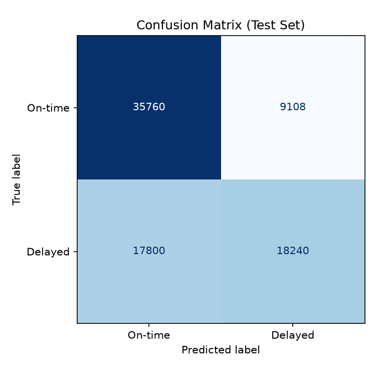
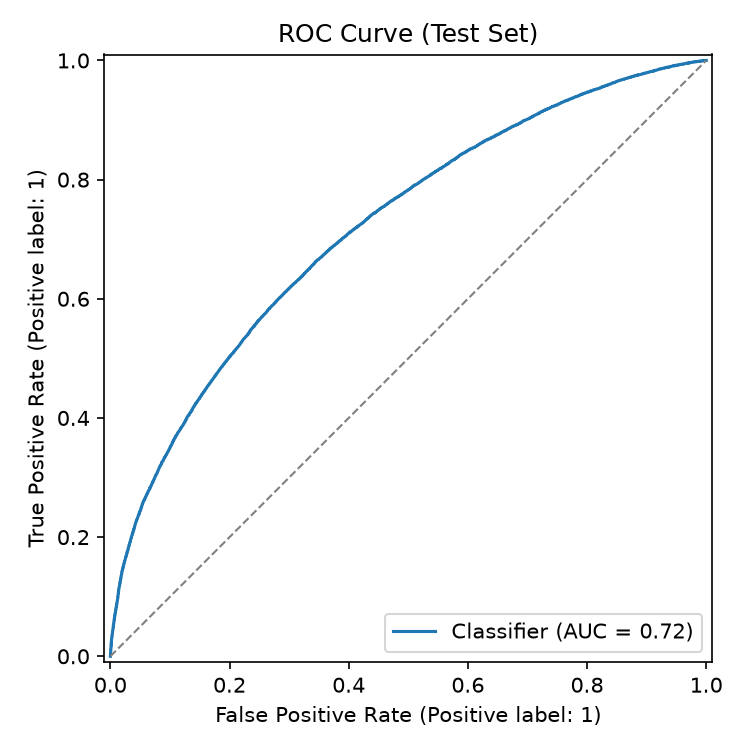
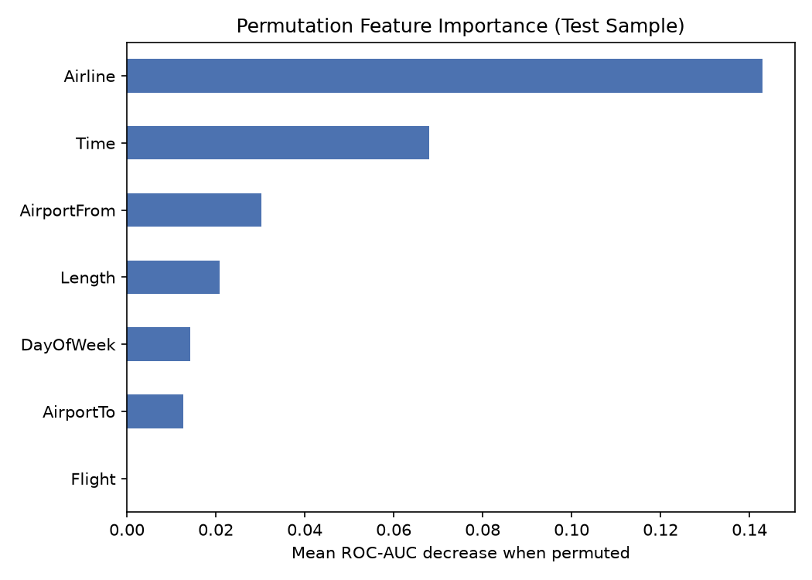

# Airline Flight Delay Prediction

End-to-end ML system predicting whether a flight will be delayed (`Class=1`) or
on-time (`Class=0`), trained on the
[Kaggle Airlines Delay dataset](https://www.kaggle.com/datasets/ulrikthygepedersen/airlines-delay/data)
(539,382 flights, no missing values).

Data → EDA → feature engineering → model selection & tuning → evaluation →
FastAPI service, with an [interactive notebook](notebooks/airline_delay_walkthrough.ipynb)
walking through every step.

## Results

Three candidates were trained and compared on a held-out validation split
(Logistic Regression baseline, Random Forest, HistGradientBoosting); the
winner was quick-tuned and evaluated once on a held-out test split
(80,908 flights, never used for model selection or tuning):

| Model | Validation ROC-AUC |
|---|---|
| **HistGradientBoostingClassifier (selected)** | **0.708** |
| Logistic Regression | 0.682 |
| Random Forest | 0.654 |

**Final test-set metrics** (HistGradientBoostingClassifier):

| Accuracy | Precision | Recall | F1 | ROC-AUC | PR-AUC |
|---|---|---|---|---|---|
| 0.667 | 0.667 | 0.506 | 0.576 | 0.721 | 0.681 |

<p>
  
  
  
</p>

`Airline` and `Time` (scheduled departure) are the strongest predictors;
`Flight` (the flight number) was tested and dropped as a feature — its
permutation importance measured exactly 0.0 (see `models/metadata.json`).
Full metrics live in [reports/metrics.json](reports/metrics.json).

An ROC-AUC around 0.72 is in line with published results on this dataset:
flight delays are driven heavily by factors this dataset doesn't capture at
all (weather, air traffic control, mechanical issues, cascading delays from
an aircraft's earlier leg), so a handful of static, per-flight columns can
only explain part of the variance.

## Project Layout

```
airlines_delay.csv          # raw dataset (not committed -- see "Get the Data")
src/airline_delay/          # data loading, feature engineering, training, evaluation
api/                         # FastAPI service
models/                      # trained pipeline + metadata (committed, ready to serve)
reports/                     # metrics.json + evaluation plots
notebooks/                   # interactive walkthrough notebook
tests/                       # pytest suite
Dockerfile                   # container image for the API
docker-compose.yml           # single-service compose file for local/VM deployment
```

## Requirements

- Python 3.12+ (matches the `python:3.12-slim` base image used for Docker)
- Docker + Docker Compose, if running the API in a container

## Get the Data

Download `airlines_delay.csv` from the
[Kaggle Airlines Delay dataset](https://www.kaggle.com/datasets/ulrikthygepedersen/airlines-delay/data)
and place it at the project root (same level as this README). The raw CSV
isn't committed to this repo (third-party data, ~18 MB) — everything else
(the trained model, metrics, plots) is, so the API works out of the box
without needing the raw data at all. You only need the CSV to retrain or to
run the notebook's data-loading/EDA cells.

## Setup

```bash
python -m venv venv

# macOS/Linux
source venv/bin/activate
# Windows (cmd.exe or PowerShell)
venv\Scripts\activate

pip install -r requirements-dev.txt
```

(`requirements-dev.txt` includes `requirements.txt` plus `pytest`/`httpx` for
testing and `notebook`/`ipykernel`/`nbconvert` for the walkthrough notebook.)
The commands below assume the venv is activated; re-run the activate step
above in each new shell.

## Train the Model

```bash
python -m src.airline_delay.train
```

Requires `airlines_delay.csv` (see "Get the Data"). This does a stratified
70/15/15 train/val/test split, trains the three candidates described above,
picks the best on validation ROC-AUC, runs a quick `RandomizedSearchCV` on a
100K-row subsample to tune it, refits on train+val, and evaluates once on
the held-out test set. Outputs:

- `models/model.joblib` — the final fitted scikit-learn `Pipeline` (feature
  engineering + preprocessing + classifier bundled together)
- `models/metadata.json` — metrics, feature schema, class label meaning, versions
- `reports/metrics.json`, `reports/figures/*.png` — confusion matrix, ROC curve,
  permutation feature importance

To regenerate metrics/plots for an already-trained model without retraining:

```bash
python -m src.airline_delay.evaluate
```

## Interactive Walkthrough Notebook

[notebooks/airline_delay_walkthrough.ipynb](notebooks/airline_delay_walkthrough.ipynb)
runs through the whole system step by step — EDA, feature engineering, model
comparison, tuning, test-set evaluation with inline plots, loading the saved
model, and calling the API — reusing the same `src/airline_delay`/`api` code
as the CLI and service, so it's guaranteed to match what actually runs in
production. Requires `airlines_delay.csv` (see "Get the Data").

```bash
pip install -r requirements-dev.txt
python -m ipykernel install --user --name=airline-delay-venv --display-name "Python (airline-delay venv)"
jupyter notebook notebooks/airline_delay_walkthrough.ipynb
```

Select the **"Python (airline-delay venv)"** kernel when prompted (or point
any existing Jupyter/VS Code install at that kernel — the `ipykernel install`
step above registers it globally, so a separate Jupyter install can find it
too). The model-comparison and hyperparameter-search cells retrain on the
full dataset and take roughly 10-15 minutes combined; every other cell runs
in seconds.

## Run the API

The API ships with a pre-trained model (`models/model.joblib`), so it runs
immediately — no need to download the dataset or retrain first.

```bash
uvicorn api.main:app --reload
```

Docs at `http://127.0.0.1:8000/docs`.

### Endpoints

- `GET /health` — liveness + whether the model is loaded
- `GET /model/info` — model version, test metrics, feature schema
- `POST /predict` — single-flight prediction
- `POST /predict/batch` — batch prediction (`{"records": [...]}`)

### Example

```bash
curl -X POST http://127.0.0.1:8000/predict \
  -H "Content-Type: application/json" \
  -d '{"Time": 1296, "Length": 141, "Airline": "DL", "AirportFrom": "ATL", "AirportTo": "HOU", "DayOfWeek": 1}'
```

Response:

```json
{"predicted_class": 1, "predicted_label": "Delayed", "probability_delayed": 0.514}
```

Note that `Flight` (the flight number) is **not** part of the request
schema — it was excluded as a model feature (see "Results" above), so the
API doesn't ask for it.

## Run with Docker

```bash
docker build -t airline-delay-api .
docker run -p 8000:8000 airline-delay-api
```

Or with Docker Compose:

```bash
docker compose up -d --build
```

Both use the committed `models/model.joblib` — no retraining or dataset
download needed to build the image. Docs at `http://localhost:8000/docs`
either way. The container runs as a non-root user and exposes a `/health`
check (`HEALTHCHECK` in the [Dockerfile](Dockerfile), wired into
`docker-compose.yml`); set `WEB_CONCURRENCY` (default 1, compose sets 2) to
change the number of uvicorn worker processes.

## Tests

```bash
pytest
```

## Notes

- `Class`: 0 = on-time, 1 = delayed. Roughly balanced (~55%/45%) in the raw data.
- `Flight` is present in the raw dataset but deliberately excluded as a model
  feature (near-zero predictive signal — it's just an identifier). The
  single source of truth for which raw columns the model consumes is
  `config.RAW_FEATURE_COLUMNS` in [src/airline_delay/config.py](src/airline_delay/config.py);
  `train.py` asserts its metadata schema stays in sync with it on every run.
- `AirportFrom`/`AirportTo` have 293 distinct values each; the tree-model
  pipeline uses native categorical support to avoid one-hot blow-up, and the
  baseline linear model uses cross-fitted target encoding to avoid leakage.
- No date/timestamp column exists (only `DayOfWeek`), so splits are random
  stratified rather than time-based.
